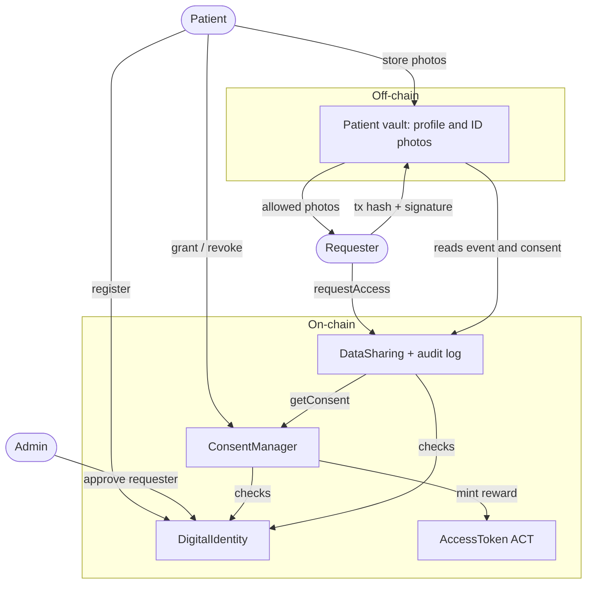
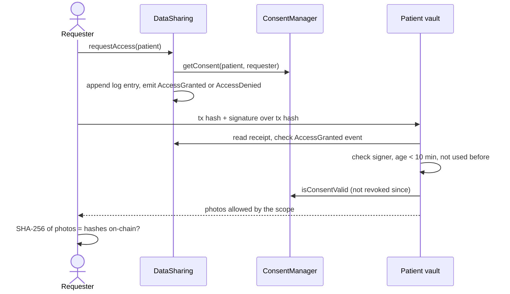
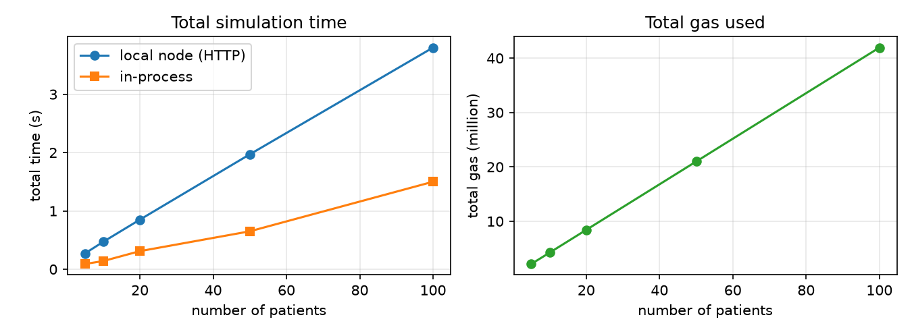

<div class="cover">
<h1>ID Share: Consent-Based Sharing of Government ID Documents in Healthcare on Ethereum</h1>
<p>BCS3210 Blockchains, Group Project Report<br>Maastricht University, Department of Advanced Computing Sciences</p>
<p><br><b>Group members</b><br>
[Name 1], [Student ID]<br>
[Name 2], [Student ID]<br>
[Name 3], [Student ID]<br>
[Name 4], [Student ID]<br>
[Name 5], [Student ID]</p>
<p><br>October 2026</p>
</div>

## 1. Introduction

When a patient registers at a clinic, a lab or an insurer, the provider usually checks a government ID and keeps a scan of it in its own system. Over the years copies of the same ID end up at many places. The patient cannot see who holds a copy or who looked at it, cannot take a copy back, and has no audit trail they can check themselves. Every provider that stores these scans is also a target: in the 2024 ransomware attack on Change Healthcare the data of 192.7 million people was affected [1]. Finally, the patients get nothing back for sharing their data.

Existing solutions solve parts of this. Hospital portals and identity verification (KYC) vendors are convenient but central, so one breach leaks everyone. The EU eIDAS regulation and the new European Digital Identity Wallet [4], [5] and W3C Verifiable Credentials [6] let users keep credentials themselves and disclose selectively, but they do not define time-limited consent or a tamper-proof access log. Blockchain research prototypes like MedRec [2] and Ancile [3] keep medical records at the providers and use Ethereum smart contracts for permissions and a history of access. We take the same idea but for a narrower and simpler case: the government ID documents of patients.

We built **ID Share**, a decentralized identity and data sharing platform on Ethereum (local Hardhat network). The photos of the front and back of the ID stay with the patient. On-chain we only store SHA-256 hashes of the photos, a salted hash of the email, consent records and the access log. A healthcare provider can only receive the photos when the patient gave consent for a limited time (1 to 365 days) and a specific part of the document, and the patient can revoke it at any moment. Every access attempt, granted or denied, is logged on-chain and cannot be deleted. Patients receive an ERC-20 reward token when they give consent, but the token never gives access to data. The rest of this report describes the architecture (Section 2), the implementation (Section 3), our tests and measurements (Section 4), and a critical discussion (Section 5).

## 2. Architecture

### 2.1 Roles

| Role | Can | Cannot |
|---|---|---|
| Patient (identity owner) | Register, update document hashes, grant and revoke consent, read own audit log | Grant consent in someone else's name, change or delete the log |
| Requester (doctor, hospital, lab, insurer) | Request access, fetch allowed photos from the patient's vault, check the hashes | Access without valid consent, grant itself consent |
| Administrator (platform operator) | Approve or remove requesters, change the reward amount, pause data sharing | See the documents, grant or revoke consent, delete log entries |

The administrator only decides which addresses belong to real healthcare providers, so a patient cannot give consent to an unknown address by mistake. We assume the administrator is honest in this decision (see Section 5).

### 2.2 Data model

Everything on a public blockchain can be read by anyone (also variables marked `private`) and can never be removed, which would also conflict with the GDPR right to erasure [7]. Our rule is therefore that anything that identifies a person stays off-chain.

| Attribute | On-chain | Off-chain | Hashed |
|---|---|---|---|
| Wallet address of patient / requester | yes | no | no (pseudonym) |
| Name, date of birth, ID number | no | yes (vault) | no |
| Email | hash only | yes | keccak256(salt, email), salt kept by the patient |
| Front and back photo of the ID | hash only | yes (vault) | SHA-256 |
| Storage reference of the vault | yes | points to vault | no |
| Consent (scope, start, end, revoked) | yes | no | no |
| Access log entry (requester, time, result, reason) | yes | no | no |
| ACT token balance | yes | no | no |

The email is salted because an email address has low entropy; a plain hash could be reversed by hashing a list of known emails.

### 2.3 Components

The system has four smart contracts and one off-chain component (Figure 1). We split the contracts by responsibility and let them call each other through small interfaces, like the multi-contract system of Lab 4. `DigitalIdentity` registers patients and approved requesters. `ConsentManager` stores consents and mints rewards. `DataSharing` handles access requests and holds the audit log. `AccessToken` is the ERC-20 reward token, which only `ConsentManager` may mint. The patient's **vault** is a small Python program that keeps the photos and only hands them out after it has verified a granted request on-chain.

<div class="fig">



</div>
<p class="caption">Figure 1: Components and their interaction.</p>

### 2.4 Consent model

A consent is given by a patient to one approved requester for a **scope** (front only, back only or both) and a **duration** of 1 to 365 days, stored as an absolute end time. Only the patient can grant or revoke. Granting again to the same requester replaces the old consent, for example to extend it. Expiry is lazy: no transaction happens when a consent expires, every check simply compares the current block time with the end time, so no one pays gas for clean-up. The first consent to a requester is rewarded with 10 ACT. Later consents to the same requester are not rewarded, otherwise a patient could grant and revoke in a loop to farm tokens.

### 2.5 Access flow and audit log

A central design decision comes from the requirement that failed access attempts must also be logged. If a denied request reverted, the EVM would roll back the log entry as well, so a denied request must not revert: `requestAccess` writes the log entry, emits `AccessGranted` or `AccessDenied` with a reason (not approved, no consent, revoked, expired) and returns true or false. The contract has no function to change or delete entries, so the log is append only.

A contract cannot keep a file secret, since all on-chain data is public. Access control for the files is therefore enforced by the vault, which trusts the chain (Figure 2). The requester sends the hash of its granted transaction and a signature over it, made with its private key, as in Tutorial 1. Because the vault only serves files for a granted on-chain request, every download also appears in the audit log. Our first design returned the document link directly from `requestAccess`; we dropped that because the link was readable on-chain without consent, and because return values of a transaction do not reach an external caller.

<div class="fig">



</div>
<p class="caption">Figure 2: Access request and file release by the vault.</p>

## 3. Implementation

We used Hardhat 3 with the viem toolbox, Solidity 0.8.28 with the optimizer (200 runs), forge-std for tests and Hardhat Ignition for deployment, the same setup as in the labs. The off-chain part is written in Python with web3.py.

### 3.1 Smart contracts

| Contract | Main functions |
|---|---|
| `DigitalIdentity` | `registerUser(emailHash, storageRef, frontHash, backHash)`, `updateDocument`, `approveRequester` / `removeRequester` (admin), `getUser`, `isRegistered`, `isApprovedRequester` |
| `ConsentManager` | `grantConsent(requester, scope, days)`, `revokeConsent(requester)`, `isConsentValid`, `getConsent`, `setRewardAmount` (admin) |
| `DataSharing` | `requestAccess(patient)`, `getLogs`, `getLog`, `getLogCount`, `pause` / `unpause` (admin) |
| `AccessToken` | ERC-20 (`transfer`, `approve`, `transferFrom`), `mint` (only the minter), `setMinter` (admin) |

Access control uses `onlyOwner` style modifiers and role mappings as in the labs, and all inputs are checked with `require` and a short message (for example "Duration must be 1-365 days"). We wrote the owner logic and the ERC-20 token ourselves instead of using OpenZeppelin, to stay close to the course material. `requestAccess` first requires that the patient is registered (a malformed request may revert), then decides the result:

```
if (!identity.isApprovedRequester(msg.sender)) reason = Reason.NotApproved;
else if (!exists) reason = Reason.NoConsent;
else if (revoked) reason = Reason.Revoked;
else if (block.timestamp >= expiresAt) reason = Reason.Expired;
granted = (reason == Reason.None);   // log + event in both cases, no revert
```

The contracts are deployed by one Ignition module in dependency order (token, identity, consent manager, data sharing), after which `setMinter` makes the consent manager the only minter.

### 3.2 Off-chain components and front-end

The Python part (`offchain/`) contains a hashing tool (SHA-256 of the photos, salted email hash that matches `keccak256(abi.encodePacked(salt, email))`), a generator for fake patients and ID images, and the vault. The vault checks, for a given transaction hash and signature: the transaction went to `DataSharing` and emitted `AccessGranted` for this patient, the recovered signer is that requester, the request is at most 10 minutes old and was not used before, and the consent is still valid. Only then does it copy the photos that the scope allows. The requester compares their hashes with the ones on-chain.

The front-end is a single web page with viem that reads contract state and events and sends transactions to the local node. It has tabs for patient, requester, administrator and the audit log. The photos are hashed in the browser, so they never leave the patient's computer. For the demo it uses the public Hardhat test accounts instead of a wallet extension.

## 4. Experimental Results

All measurements were made on a laptop with Hardhat 3.18 (local node, chain id 31337). The scripts and raw results are in the repository.

### 4.1 Tests

We wrote 64 tests in Solidity, all passing, one of them a fuzz test with 256 runs. No personal data is used, only generated addresses and fake hashes.

| Test file | Tests | Most important properties checked |
|---|---|---|
| `AccessToken.t.sol` | 10 | only the minter can mint (not even the owner); ERC-20 transfers and allowances |
| `DigitalIdentity.t.sol` | 16 | correct hashes stored; no double or empty registration; only admin approves requesters |
| `ConsentManager.t.sol` | 21 | 1 and 365 days accepted, 0 and 366 rejected; exact expiry; reward only once per requester; only the patient revokes |
| `DataSharing.t.sol` | 13 | denied requests return false and are logged with the right reason instead of reverting; no tokens move during access; pause |
| `Integration.t.sol` | 4 | full flow register, grant, access, revoke, re-grant, expiry; consent is per patient and per requester |

The most critical tests are the denied-access tests. They prove that the requirement "failed attempts are logged" really holds, which would silently break if someone changed the code to revert. In addition, the Python demo showed end to end that a granted request receives the photos with matching hashes, that a request cannot be reused, that someone else cannot use the doctor's request, that a changed photo is detected, and that the vault refuses after revocation.

### 4.2 Gas cost and optimisation

We measured gas with a script that runs a fixed scenario with 10 patients and 2 requesters. Because access requests will happen much more often than anything else, we reduced storage writes (a new storage slot costs 20,000 gas [8], [9]). We stored timestamps as `uint64` so that a consent and a log entry each fit into one 32-byte slot [10], kept the reward flag inside the packed consent, made contract references `immutable`, and removed a redundant request counter.

| Operation | Before | After | Change |
|---|---|---|---|
| requestAccess (granted) | 107,429 | 70,108 | -34.7% |
| requestAccess (denied, revoked) | 107,531 | 70,210 | -34.7% |
| requestAccess (first log entry of a patient) | 126,321 | 87,290 | -30.9% |
| grantConsent (first, with reward) | 187,290 | 94,835 | -49.4% |
| grantConsent (again, no reward) | 53,229 | 39,283 | -26.2% |
| registerUser | 167,975 | 145,921 | -13.1% |
| revokeConsent | 30,938 | 28,969 | -6.4% |
| Deployment of all contracts + setMinter | 3,140,723 | 3,168,143 | +0.9% |

Deployment of the four contracts costs 3.17 million gas in total (about 0.063 ETH at an example gas price of 20 gwei), which is slightly more after the optimisation. Since deployment happens once and requests happen all the time, this is a good trade-off. A granted request now costs 70,108 gas, about 0.0014 ETH at 20 gwei.

### 4.3 Simulation and scalability

The simulation script deploys fresh contracts and creates N patients, N/5 requesters and one administrator with new accounts. Every patient registers and gives consent, every requester requests access, half of the patients revoke and all requests are repeated. We measured the time from sending a transaction until its receipt.

| Patients | Transactions | Total gas | Total time (s) | Throughput (tx/s) | Reading all access events (ms) |
|---|---|---|---|---|---|
| 5 | 24 | 2,143,847 | 0.27 | 88.0 | 7.8 |
| 10 | 47 | 4,224,675 | 0.47 | 99.4 | 3.8 |
| 20 | 94 | 8,415,198 | 0.85 | 110.2 | 5.1 |
| 50 | 235 | 20,987,175 | 1.97 | 119.1 | 16.0 |
| 100 | 470 | 41,939,790 | 3.80 | 123.6 | 27.3 |

<div class="fig"></div>
<p class="caption">Figure 3: Total time (local node and in-process network) and total gas against the number of patients.</p>

The gas per operation stays the same for 5 and 100 patients (for example 70,108 for every granted request), because no function loops over users; each only touches the storage of one patient and requester. So the total cost grows linearly, at about 420,000 gas per patient for this scenario. The average confirmation time is 8 to 10 ms per transaction on the local node and about three times less on Hardhat's in-process network, which has no HTTP layer. Reading the full audit trail from the events stays fast (27 ms for 200 events).

## 5. Discussion and Conclusion

The platform meets the requirements of the project: identity data stays with the patient, consent is time limited, scoped and revocable, every attempt including failed ones is logged immutably, only requesters with valid consent get the files, and patients are rewarded without the token ever giving access or ownership. The tests, the end-to-end demo, the front-end and the simulation all behave as designed.

There are also clear limits. The local node confirms a transaction in milliseconds, while on Ethereum mainnet a block takes about 12 seconds and every request costs a fee, so the numbers in Section 4.3 are best cases. Moving the contracts to a Layer-2 rollup would lower the cost. The chain is public, so anyone can see which requester asked for which patient's address and when. The addresses are pseudonymous, but the pattern of visits is still visible; zero-knowledge proofs could hide this. The administrator is a single trusted party for approving requesters and should be a multi-signature wallet or a group of institutions. The vault must be online, and a requester that received the photos can keep copies. The blockchain can prove that access happened, but it cannot force deletion. Files should also be encrypted for the requester during transfer, and the front-end should use a wallet like MetaMask instead of test keys. Finally, the reward token has no real economic value in our prototype.

To conclude, we showed that a small set of smart contracts can give patients control over who sees their ID documents and a trustworthy record of every attempt, at about 70,000 gas per access request after optimisation, with cost and time growing linearly in the number of users. The most important lessons were that failed attempts must not revert to be logged, and that on-chain data is public, so real access control over files has to be enforced off-chain, based on on-chain proofs.

## 6. Contributions and Use of Generative AI

| Member | Contribution |
|---|---|
| [Name 1] | [e.g. research, problem statement, report sections 1 and 5] |
| [Name 2] | [e.g. smart contract design and implementation] |
| [Name 3] | [e.g. tests and gas measurements] |
| [Name 4] | [e.g. simulation, Python vault] |
| [Name 5] | [e.g. front-end, presentation] |

*Transparency statement.* We used generative AI (Claude, Anthropic) for: summarising the course material, reviewing a first version of our design, drafting the contract code, tests, scripts, the Python vault and the front-end, and drafting the text of the step deliverables and this report. The parts of our work affected are the code in the repository and the written deliverables. We have reviewed, run and tested all code, checked the numbers against our own measurements and the references against their sources, and we take responsibility for the submitted work. [Adjust this statement to your actual use before submission.]

## References

[1] The HIPAA Journal, "Change Healthcare Responding to Cyberattack", https://www.hipaajournal.com/change-healthcare-responding-to-cyberattack/ (accessed 30 Sep 2026).<br>
[2] A. Azaria, A. Ekblaw, T. Vieira, A. Lippman, "MedRec: Using Blockchain for Medical Data Access and Permission Management", 2nd International Conference on Open and Big Data (OBD), 2016.<br>
[3] G. G. Dagher, J. Mohler, M. Milojkovic, P. B. Marella, "Ancile: Privacy-preserving framework for access control and interoperability of electronic health records using blockchain technology", Sustainable Cities and Society, vol. 39, pp. 283-297, 2018.<br>
[4] Regulation (EU) No 910/2014 on electronic identification and trust services (eIDAS).<br>
[5] Regulation (EU) 2024/1183 establishing the European Digital Identity Framework.<br>
[6] W3C, "Verifiable Credentials Data Model v2.0", W3C Recommendation, 2025.<br>
[7] Regulation (EU) 2016/679 (General Data Protection Regulation), Art. 9 and Art. 17.<br>
[8] G. Wood, "Ethereum: A Secure Decentralised Generalised Transaction Ledger" (Yellow Paper).<br>
[9] V. Buterin, M. Swende, "EIP-2929: Gas cost increases for state access opcodes", 2020.<br>
[10] Solidity documentation, "Layout of State Variables in Storage", https://docs.soliditylang.org.
