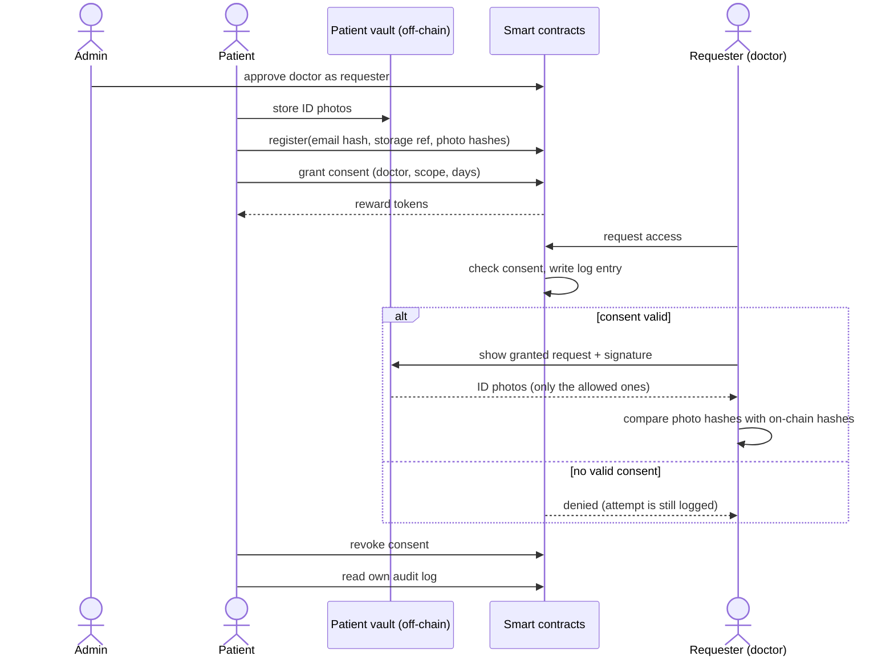

# Step 1: Research and Planning

BCS3210 Blockchains group project: Decentralized Digital Identity and Data Sharing Platform 
Domain: identity verification in healthcare (government ID documents)

## What we did in this step

We picked our application domain, looked at how identity documents are handled today in healthcare and in other identity systems, and used that to write down the problem, the roles in our system, the functional requirements and a first overview of how the users interact.

## 1. Problem statement

When a patient registers at a clinic, a lab or an insurer, the provider usually wants to see a government ID (ID card, passport or driving licence). In practice the front desk makes a scan or a copy and keeps it in its own system. After a few years a patient's ID is stored at many places, and the patient:

- does not know who has a copy and who looked at it,
- cannot take the copy back once it is made,
- has no audit trail they can check, the logs (if any) are inside the provider's own system,
- gets nothing back for sharing, while the providers and data brokers carry all the value.

Every provider that stores these scans is also a target for attackers. A single breach exposes all patients at once. The ransomware attack on Change Healthcare in February 2024 affected 192.7 million people, the largest health data breach in the US so far [1].

Our idea is to leave the ID photos with the patient (off-chain) and only put **hashes, consent records and access logs** on a blockchain. A provider can only get the photos when the patient has given consent that is still valid, every attempt is logged in a way nobody can delete, and the provider can check with the hash that the photos were not changed.

## 2. How existing systems handle this

| System | How it works | What works | What does not work |
|---|---|---|---|
| Hospital patient portals / front desk scans | Each hospital stores the ID scan in its own database | Simple, already integrated in hospital software | Central store per provider, one breach leaks everyone; patient cannot see or revoke access; no shared audit trail |
| EU eIDAS and the European Digital Identity Wallet [4], [5] | Government issued digital identity, wallet on the phone, user chooses what to share | Strong legal basis, selective disclosure in the new wallet | Still being rolled out; access history is not a public, tamper-proof log; depends on government infrastructure |
| Identity verification (KYC) vendors | Company checks the ID once and keeps the photos, re-used by its clients | Convenient for the user | Photos stay at a commercial company for a long time; user has no control over re-use |
| W3C Verifiable Credentials [6] | Issuer signs a credential, the user keeps it in a wallet and shows proofs | User holds the data, good privacy model | Standard only, it does not define time-limited consent or access logging |
| MedRec [2] | Ethereum smart contracts store pointers to medical records and permissions; data stays at the providers | Patient sees all permissions in one place, immutable history | Research prototype; data still stored at providers |
| Ancile [3] | Ethereum based access control for health records with cryptographic protection of the references | Fine-grained access control, privacy of references | Complex (several contracts and cryptography), heavy for a simple use case |

What we take from this:

1. Keep the documents themselves off the chain, like MedRec and Verifiable Credentials. Personal data on a public ledger can never be removed again, which also conflicts with the GDPR right to erasure [7].
2. Consent must be explicit, limited in time and revocable at any moment.
3. The audit log should belong to the patient and must be tamper proof, this is what a blockchain is good at.
4. Give the patient something back for sharing (a reward token).

## 3. Users and roles

| Role | Who | Starts these actions | Is not allowed to |
|---|---|---|---|
| Patient (identity owner) | Person who owns the ID document | Register, update document hashes, grant consent, revoke consent, view own audit log | Grant consent for someone else, change the log |
| Requester | Approved healthcare provider (doctor, hospital, lab, insurer) | Request access to a patient's documents, fetch the files from the patient's vault, check the hashes | Access without valid consent, grant itself consent, delete log entries |
| Administrator | Operator of the platform (deployer of the contracts) | Approve and remove requesters, set the reward amount, pause data sharing in an emergency | See the documents, grant or revoke consent, delete log entries |

The administrator is on purpose kept out of the data path. It only decides which addresses are real healthcare providers, so patients cannot give consent to a random address by mistake.

## 4. Functional requirements

| ID | Requirement |
|---|---|
| FR1 | A patient registers with minimal data: a salted hash of the email, a reference to the off-chain storage and the SHA-256 hashes of the front and back photo of the ID. No plain personal data goes on-chain. |
| FR2 | A patient can update the document hashes, for example after the ID was renewed. |
| FR3 | The administrator can approve and remove requesters. |
| FR4 | A patient can grant consent to an approved requester for a scope (front only, back only or both) and a duration of 1 to 365 days. |
| FR5 | A patient can revoke a consent at any time; it stops working immediately. |
| FR6 | A consent automatically stops being valid when it expires, no transaction is needed. |
| FR7 | A requester can request access; the contract checks whether there is a valid consent. |
| FR8 | Every access attempt, granted or denied, is logged with requester, time, result and reason. Logs cannot be changed or deleted. |
| FR9 | The patient receives reward tokens (ACT) the first time they give consent to a requester. Tokens never give access and never move during data access. |
| FR10 | The patient's off-chain vault only releases the files that the consent scope allows, and only after a granted request on-chain. |
| FR11 | The requester can check the received files against the hashes on-chain. |

Non-functional requirements: no personal data on-chain, the log is append only, the access path should use as little gas as possible because access is expected often, and the system must run on a local Hardhat network.

## 5. How the users interact

## References

[1] The HIPAA Journal, "Change Healthcare Responding to Cyberattack", https://www.hipaajournal.com/change-healthcare-responding-to-cyberattack/ (accessed 30 Sep 2026). 
[2] A. Azaria, A. Ekblaw, T. Vieira, A. Lippman, "MedRec: Using Blockchain for Medical Data Access and Permission Management", 2nd International Conference on Open and Big Data (OBD), 2016. 
[3] G. G. Dagher, J. Mohler, M. Milojkovic, P. B. Marella, "Ancile: Privacy-preserving framework for access control and interoperability of electronic health records using blockchain technology", Sustainable Cities and Society, vol. 39, pp. 283-297, 2018. 
[4] Regulation (EU) No 910/2014 on electronic identification and trust services (eIDAS). 
[5] Regulation (EU) 2024/1183 establishing the European Digital Identity Framework. 
[6] W3C, "Verifiable Credentials Data Model v2.0", W3C Recommendation, 2025. 
[7] Regulation (EU) 2016/679 (General Data Protection Regulation), Art. 9 and Art. 17.
