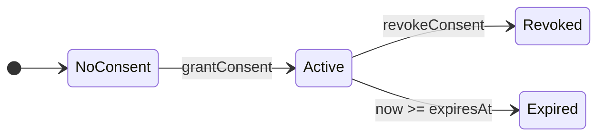
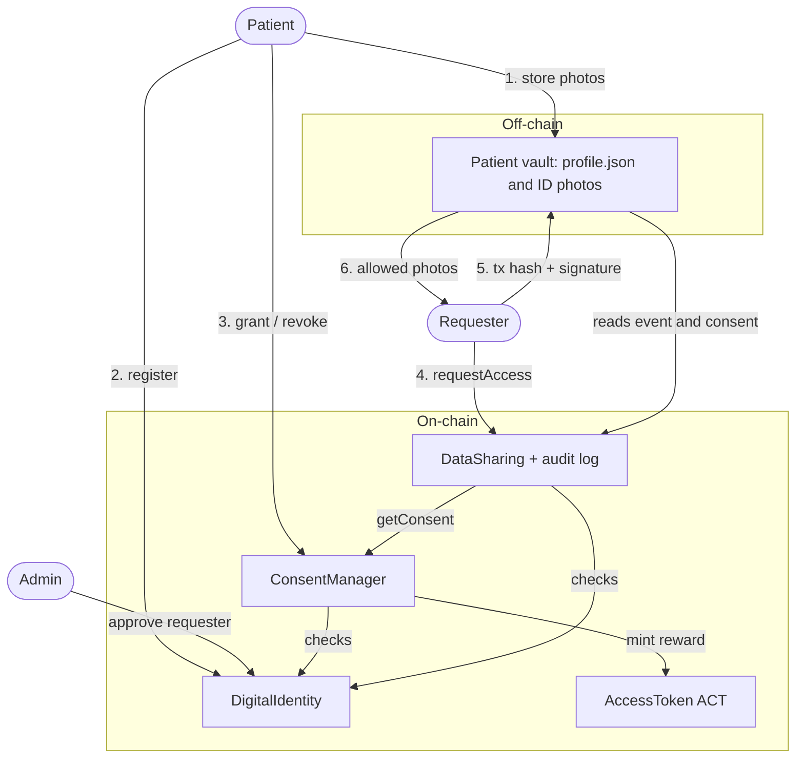

# Step 2: Platform and System Design

<p class="subtitle">BCS3210 Blockchains group project: Decentralized Digital Identity and Data Sharing Platform</p>

## What we did in this step

We decided which data goes on-chain and which stays off-chain, designed the consent model and the audit log, split the system into smart contracts plus an off-chain vault, and drew the architecture. The design follows the patterns from the labs: owner and role modifiers, state machines with enums, time checks with `block.timestamp`, and contracts that talk to each other through interfaces (Lab 4).

## 1. Data model

A patient's ID document is two photos (front and back). The rule we use is: anything that identifies a person stays off-chain, and only hashes, references and permission records go on-chain. Everything on a public blockchain can be read by anybody, also variables marked `private`, and it can never be deleted.

| Attribute | On-chain? | Off-chain? | Hashed? |
|---|---|---|---|
| Wallet address of patient / requester | Yes | No | No (already a pseudonym) |
| Full name, date of birth, ID number, blood type | No | Yes (`profile.json` in the vault) | No |
| Email | Only the hash | Yes | Yes, `keccak256(salt, email)`. The salt stays with the patient, otherwise the email could be guessed by trying common emails |
| Front photo of ID | Only the hash | Yes (`id_front.png`) | Yes, SHA-256 |
| Back photo of ID | Only the hash | Yes (`id_back.png`) | Yes, SHA-256 |
| Storage reference (e.g. `vault://patient1`) | Yes | Points to the vault | No, it is not secret. Without a granted request the vault does not give anything |
| Consent (requester, scope, start, end, revoked) | Yes | No | No, contracts must be able to check it |
| Access log entry (requester, time, result, reason) | Yes | No | No |
| ACT token balance | Yes | No | No |

Off-chain the patient keeps one folder (the vault) with `profile.json`, `id_front.png`, `id_back.png` and `salt.txt`.

## 2. Consent model

- **What can be shared:** the scope is `FrontOnly`, `BackOnly` or `Both`.
- **Duration:** 1 to 365 days, stored as `expiresAt = block.timestamp + days * 1 days`.
- **Who grants and revokes:** only the patient, for their own consents, and only to requesters approved by the admin. The admin and the requester can never grant consent.
- **Granting again** to the same requester replaces the old consent (e.g. to extend it or change the scope).
- **Expiry:** nothing happens on-chain when a consent expires. Every check compares `block.timestamp` with `expiresAt`, so an expired consent is simply not valid anymore and no one has to pay gas to clean it up.
- **Reward:** the first consent to a requester mints 10 ACT to the patient. Later grants to the same requester give nothing, otherwise a patient could grant and revoke in a loop to farm tokens. Tokens are never checked for access.



From `Revoked` or `Expired` the patient can call `grantConsent` again, which makes a new active consent. Calling `grantConsent` while a consent is active replaces it.


```
grantConsent(requester, scope, days):
    require sender is a registered patient
    require requester is approved
    require 1 <= days <= 365
    consents[sender][requester] = (scope, now, now + days, revoked=false, exists=true)
    emit ConsentGranted
    if not rewarded[sender][requester]:
        rewarded[sender][requester] = true
        token.mint(sender, rewardAmount)

revokeConsent(requester):
    require consent exists, not revoked, not expired
    consents[sender][requester].revoked = true
    emit ConsentRevoked

isConsentValid(patient, requester):
    return exists and not revoked and now < expiresAt
```

## 3. Audit log

For every call to `requestAccess` we store an entry in the list of the patient and emit an event:

| Field | Meaning |
|---|---|
| requester | Address that asked |
| scope | Scope of the consent (only meaningful when granted) |
| result | `Granted` or `Denied` |
| reason | `None`, `NotApproved`, `NoConsent`, `Revoked` or `Expired` |
| timestamp | `block.timestamp` of the attempt |

- A denied request does **not** revert. A revert would also undo the log entry, so failed attempts would not be recorded. The function returns `false` instead.
- The contract has no function to edit or delete entries, and the events stay in the blockchain history anyway. So the log is append only.
- Reasons are an enum instead of a string, which is cheaper to store.
- Anyone can read the log (like all on-chain data). That is acceptable because it only contains addresses and times, no personal data.

## 4. Smart contract design

We use four contracts. Each has one job, and they call each other through small interfaces, as in the Campus Bounty system of Lab 4.

| Contract | Component | Job |
|---|---|---|
| `DigitalIdentity` | Digital identity | Register patients (hashes + storage reference), approve requesters |
| `ConsentManager` | Digital identity | Grant, revoke and check consent, mint rewards |
| `DataSharing` | Data sharing | Access requests, consent check, audit log |
| `AccessToken` | Incentive | ERC-20 reward token (ACT), only `ConsentManager` can mint |

| Contract | Function | Who can call | What it does |
|---|---|---|---|
| DigitalIdentity | `registerUser(emailHash, storageRef, frontHash, backHash)` | anyone, once | Register the caller as patient |
| | `updateDocument(storageRef, frontHash, backHash)` | registered patient | New hashes after renewing the ID |
| | `approveRequester(addr)` / `removeRequester(addr)` | admin | Manage the list of healthcare providers |
| | `getUser(addr)`, `isRegistered(addr)`, `isApprovedRequester(addr)` | anyone (view) | Read identity data |
| ConsentManager | `grantConsent(requester, scope, days)` | registered patient | Create or replace consent, reward on first grant |
| | `revokeConsent(requester)` | patient | Revoke directly |
| | `isConsentValid(patient, requester)`, `getConsent(...)` | anyone (view) | Check consent |
| | `setRewardAmount(amount)` | admin | Change the reward |
| DataSharing | `requestAccess(patient)` | anyone | Check consent, log the attempt, return true or false |
| | `getLogs(patient)`, `getLog(patient, i)`, `getLogCount(patient)` | anyone (view) | Read the audit log |
| | `pause()` / `unpause()` | admin | Emergency stop (like EscrowManager in Lab 4) |
| AccessToken | `mint(to, amount)` | only ConsentManager | Create reward tokens |
| | `setMinter(addr)` | admin | Set the minter once after deployment |
| | `transfer`, `approve`, `transferFrom`, `balanceOf` | token holders | Standard ERC-20 |

Deployment order: `AccessToken` then `DigitalIdentity` then `ConsentManager(identity, token)` then `DataSharing(identity, consentManager)`, and after that `token.setMinter(consentManager)`.

## 5. Off-chain part: the patient's vault

The contracts can only decide who is allowed; they cannot hide a file, because all on-chain data is public. So the files are handed out by a small Python program, the patient's vault, which trusts the chain:

1. The requester calls `requestAccess(patient)` and signs the transaction hash with their private key (the same signature idea as in Tutorial 1).
2. The requester sends the transaction hash and the signature to the vault.
3. The vault checks: the transaction went to `DataSharing` and emitted `AccessGranted` for this patient, the signature belongs to the requester in that event, the request is not older than 10 minutes and was not used before, and the consent is still valid.
4. The vault copies only the photos that the scope allows.
5. The requester hashes the photos and compares them with `frontHash` / `backHash` on-chain.

Because the vault needs a granted request, every download also has a matching entry in the on-chain audit log.

## 6. Architecture


