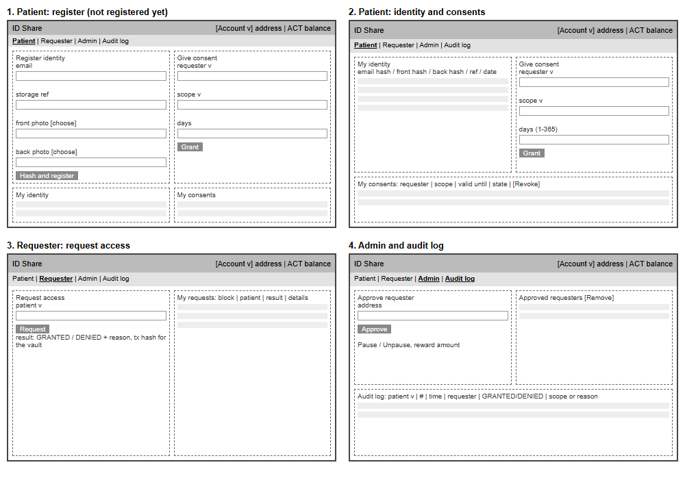
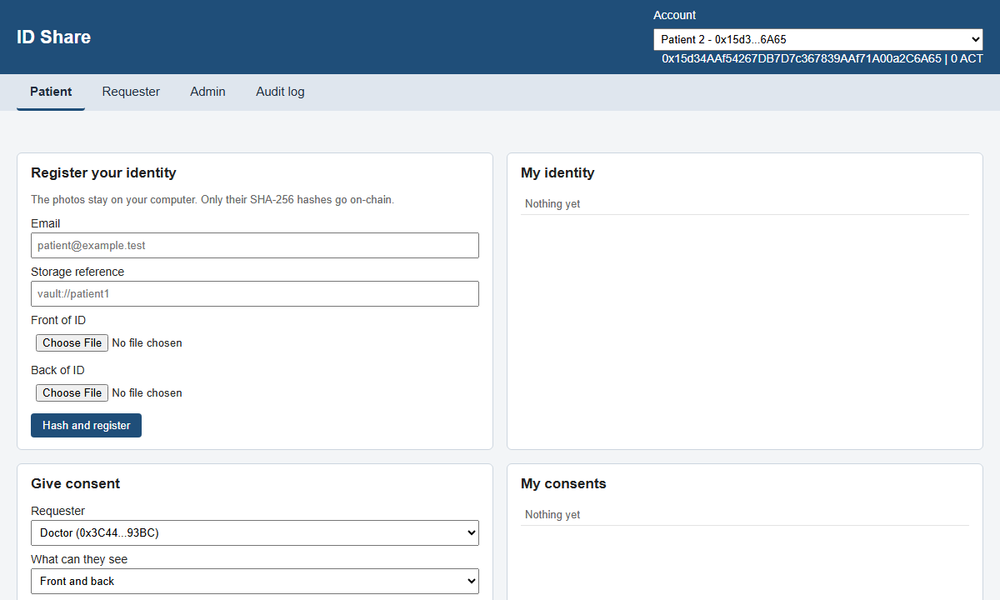
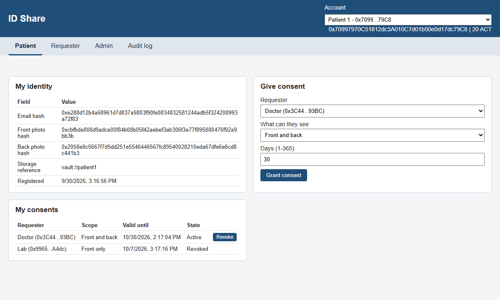
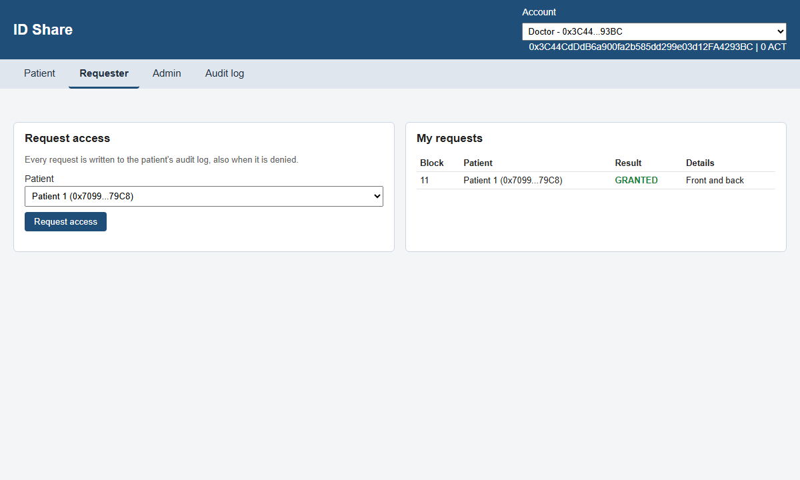
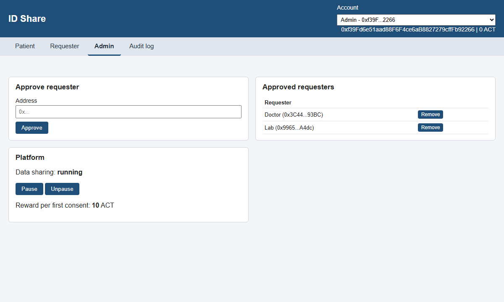
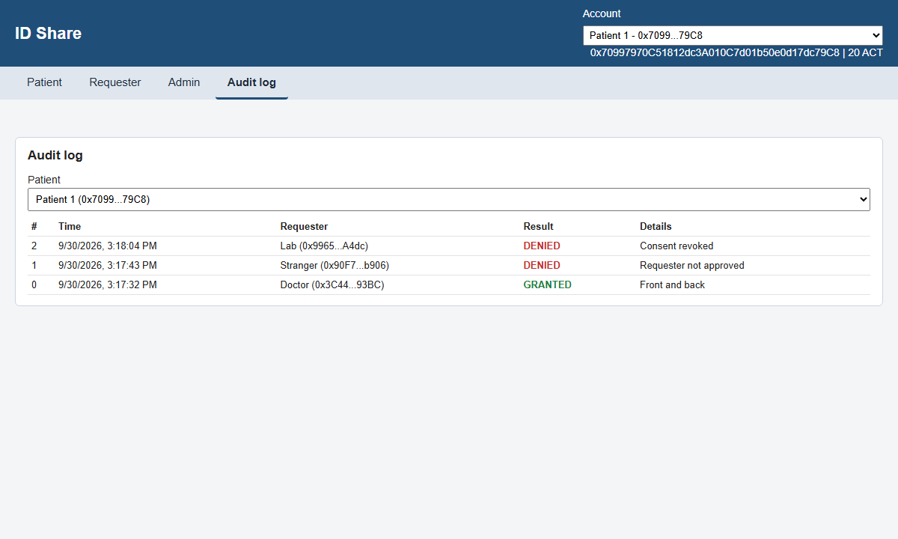

# Step 6: Front-End

<p class="subtitle">BCS3210 Blockchains group project: Decentralized Digital Identity and Data Sharing Platform</p>

## What we did in this step

We made wireframes for the four screens and then built a small web front-end ("ID Share") with plain HTML, CSS and JavaScript. It talks to the contracts on the local Hardhat node with **viem** (the same library as in the Hardhat scripts). With it you can register an identity, give and revoke consent, request access and read the audit log. We tested every function by hand in the browser.

## 1. Wireframes

We kept the layout simple: an account selector at the top, four tabs (Patient, Requester, Admin, Audit log) and cards with one task each.

<p></p>

## 2. How it works

| Part | What it does |
|---|---|
| `frontend/index.html`, `style.css` | Page layout with the four tabs; the grid falls back to one column on small screens |
| `frontend/app.js` | viem `publicClient` for reads and events, `walletClient` for transactions, both over HTTP to `http://127.0.0.1:8545` |
| `frontend/contracts.js` | Addresses and ABIs, generated after deployment by `scripts/export-frontend.mjs` from the Ignition output and the Hardhat artifacts |
| `frontend/server.mjs` | Tiny static file server (Node, no extra packages) on `http://localhost:5173` |

- **Accounts.** For the demo the page uses the default Hardhat test accounts (Admin, Patient 1, Doctor, Stranger, Patient 2, Lab). viem signs the transactions locally with these public test keys, so no wallet extension is needed. In a real version this would be MetaMask.
- **Registration.** The patient picks the two ID photos. The browser computes the SHA-256 hashes (`crypto.subtle`) and the salted email hash (`keccak256(encodePacked(salt, email))`), so the photos never leave the computer. The salt is shown once so the patient can keep it.
- **Lists** (approved requesters, patients, consents, a requester's own requests) are built from contract events, for example `ConsentGranted` filtered by patient, plus a call to `getConsent` for the current state.
- **Errors.** When a transaction reverts, the `require` message from the contract is shown, for example "Duration must be 1-365 days".

Start it:

```
npx hardhat node          # terminal 1
npm run deploy:local      # terminal 2
npm run frontend          # then open http://localhost:5173
```

## 3. Screenshots

### Patient: registration form (account that is not registered yet)

<p></p>

### Patient: identity, give consent, list of consents with revoke

<p></p>

### Requester: request access and own request history

<p></p>

### Admin: approve / remove requesters, pause

<p></p>

### Audit log of a patient (newest first, granted and denied attempts)

<p></p>

## 4. Manual test in the browser

On a fresh node we clicked through this scenario; everything behaved as expected and there were no errors in the browser console.

| Step | Action in the UI | Result |
|---|---|---|
| 1 | Admin approves Doctor and Lab | Both listed as approved (49,692 gas each) |
| 2 | Patient 1 registers with two photos | Hashes shown under "My identity" (161,311 gas) |
| 3 | Patient 1 gives Doctor "front and back" for 30 days, Lab "front only" for 7 days | Both consents Active, balance 20 ACT |
| 4 | Patient 1 tries 400 days | Error "Duration must be 1-365 days", nothing changed |
| 5 | Doctor requests access | GRANTED, tx hash shown for the vault, Doctor still has 0 ACT |
| 6 | Stranger requests access | DENIED, "Requester not approved", logged |
| 7 | Patient 1 revokes Lab, Lab requests | DENIED, "Consent revoked", logged |
| 8 | Admin pauses, Doctor requests, Admin unpauses | "Contract is paused" error, then running again |
| 9 | Audit log tab for Patient 1 | Shows the 3 logged attempts with results and reasons |
| 10 | Phone width (375 px) | One column layout, no horizontal scrolling |
