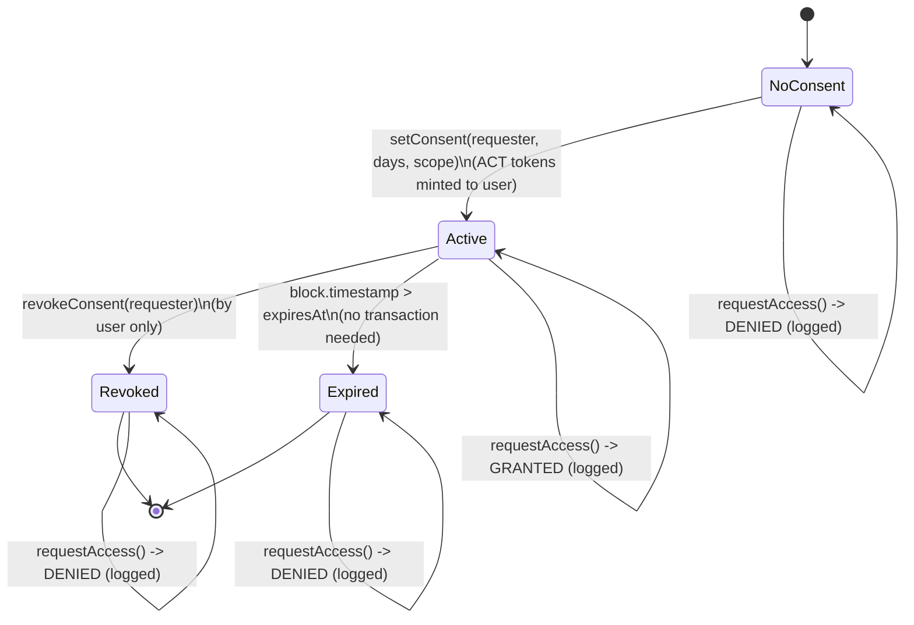
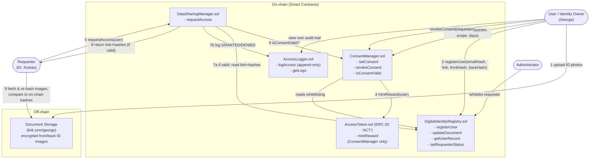

# Step 2 — Platform/System Design

## A. Data Model

### A.1 Identity Attributes

The only attributes strictly necessary to (a) uniquely identify a user on-chain and
(b) let a requester verify + integrity-check a government ID are:

- A **wallet address** (the on-chain identity/account).
- An **email hash** (used off-chain for account recovery/notifications; hashed
  on-chain purely to allow a uniqueness check without exposing the raw email).
- A **document reference link** — a URL/URI pointing to where the encrypted front/back
  ID images are actually stored (e.g. `link.com/george`; could later be an IPFS CID).
- A **SHA-256 hash of the front-of-ID image**.
- A **SHA-256 hash of the back-of-ID image**.

Everything else (real name, physical ID number, date of birth, the images themselves)
lives off-chain, under the user's control, and is never written to the ledger.

### A.2 On-chain / Off-chain / Hashed Table

| Attribute | Stored On-Chain? | Stored Off-Chain? | Hashed? |
|---|:---:|:---:|:---:|
| Wallet address | ✅ | — | No (it's already a public key-derived identifier) |
| Full name | ❌ | ✅ | No |
| Email address | ❌ | ✅ (plaintext, for notifications) | ✅ hash stored on-chain for uniqueness check |
| Government ID number/type | ❌ | ✅ | Optional — a hash *can* be stored on-chain to block duplicate registrations without revealing the number |
| Document storage link (`link.com/george`) | ✅ | (points to off-chain location) | No |
| Front-of-ID image (actual photo) | ❌ | ✅ (encrypted at the link) | ✅ SHA-256 hash stored on-chain |
| Back-of-ID image (actual photo) | ❌ | ✅ (encrypted at the link) | ✅ SHA-256 hash stored on-chain |
| Consent record (requester, scope, expiry, revoked flag) | ✅ | — | No (needs to be readable/checkable by contracts) |
| Access log entry (requester, timestamp, outcome) | ✅ | — | No |
| ACT token balances | ✅ | — | No |

**Rule of thumb applied throughout:** anything that identifies a *person* stays
off-chain; anything needed to *verify integrity* or *enforce/prove permission* goes
on-chain, and only ever as a hash, link, or access-control record — never as raw PII.

### A.3 Consent Model

**What can be shared (data scope):**

| Scope value | Meaning |
|---|---|
| `FRONT_ONLY` | Requester may retrieve the link + front-of-ID hash only |
| `BACK_ONLY` | Requester may retrieve the link + back-of-ID hash only |
| `BOTH` | Requester may retrieve the link + both hashes (typical case for identity verification) |

**Duration:** 1–365 days, chosen by the user per grant (`setConsent` rejects 0 or
>365). Stored as an absolute `expiresAt = block.timestamp + durationInDays * 1 days`.

**Who can grant/revoke:**
- Only the identity owner (`msg.sender == user`) can call `setConsent` or
  `revokeConsent` for their own record — enforced in every state-changing function.
- Requesters can never grant themselves consent.
- The Administrator can never grant or revoke consent on a user's behalf — the admin
  role is limited to whitelisting requester addresses and setting the token reward
  parameter, keeping it out of the actual data-access decision path.

**What happens on expiry:**
- No transaction is required to "expire" a consent (this avoids wasted gas from
  someone having to proactively clean up state). Instead, `isConsentValid(user,
  requester)` is a pure read computed as:
  `consent.exists && !consent.revoked && block.timestamp <= consent.expiresAt`.
- Any `requestAccess` call after expiry is treated exactly like "no consent" — it is
  denied and logged as `DENIED`.

**Consent lifecycle (state diagram):**



**Consent workflow (pseudocode):**

```
function setConsent(requester, durationDays, scope):
    require(msg.sender is a registered user)
    require(requester is a whitelisted healthcare provider)
    require(1 <= durationDays <= 365)
    consents[msg.sender][requester] = Consent(
        scope: scope,
        grantedAt: now,
        expiresAt: now + durationDays * 1 day,
        revoked: false
    )
    emit ConsentGranted(msg.sender, requester, scope, expiresAt)
    AccessToken.mintReward(msg.sender, REWARD_AMOUNT)   # incentive, not access control

function revokeConsent(requester):
    require(msg.sender is a registered user)
    require(consents[msg.sender][requester] exists)
    consents[msg.sender][requester].revoked = true
    emit ConsentRevoked(msg.sender, requester)

function isConsentValid(user, requester) -> bool:
    c = consents[user][requester]
    return c.exists AND NOT c.revoked AND now <= c.expiresAt
```

### A.4 Audit Log Design

**Events recorded per access attempt:**
- `user` — whose identity record was targeted.
- `requester` — who attempted the access.
- `timestamp` — `block.timestamp` of the attempt.
- `outcome` — `GRANTED` or `DENIED`.
- `reason` (for denials) — `NO_CONSENT`, `EXPIRED`, or `REVOKED`, for easier
  off-chain analytics/dashboards.

**Can logs be deleted?** No. The log contract exposes only *append* functionality
(`logAccess`, callable exclusively by the `DataSharingManager` contract); there is no
`delete`/`remove`/`update` function of any kind, and log entries are additionally
emitted as `event`s, which are permanently part of the blockchain's transaction
history regardless of contract state. This gives every user an immutable, independently
verifiable record of exactly who looked at their identity reference and when —
addressing the "no visibility into who accesses data" and "no immutable audit trail"
problems directly.

**Access logging workflow (pseudocode):**

```
function requestAccess(user):
    if isConsentValid(user, msg.sender):
        logAccess(user, msg.sender, GRANTED, reason="")
        return (documentLink[user], frontHash[user], backHash[user])
    else:
        reason = determineReason(user, msg.sender)  # NO_CONSENT / EXPIRED / REVOKED
        logAccess(user, msg.sender, DENIED, reason)
        revert("Access denied: " + reason)
```

## B. Smart Contract Design

The system is split into four small, single-responsibility contracts rather than one
monolith, so each piece can be reasoned about (and gas-profiled) independently in
Step 4:

| Contract | Responsibility |
|---|---|
| `DigitalIdentityRegistry.sol` | User registration; stores email hash, document link, front/back image hashes; requester whitelisting (admin) |
| `ConsentManager.sol` | Create/revoke consent records; validity checks; triggers ACT reward on grant |
| `AccessLogger.sol` | Append-only audit trail of every access attempt (granted or denied) |
| `DataSharingManager.sol` | Entry point for requesters; orchestrates the consent check → release reference → log flow |
| `AccessToken.sol` (ERC-20) | The incentive token (ACT); minting restricted to `ConsentManager` |

### B.1 Digital Identity component — `DigitalIdentityRegistry.sol`

| Function | Signature | Caller | Description |
|---|---|---|---|
| Register User | `registerUser(bytes32 emailHash, string calldata documentLink, bytes32 frontHash, bytes32 backHash)` | Any new user | Requires the caller isn't already registered; stores the four fields keyed by `msg.sender`. Minimal data — no name, DOB, or ID number ever touches this function. |
| Update Document | `updateDocument(string calldata newLink, bytes32 newFrontHash, bytes32 newBackHash)` | Registered user, self only | Lets a user point to a re-uploaded/renewed ID without re-registering their whole account. |
| Retrieve User Info | `getUserRecord(address user) view returns (bytes32 emailHash, string memory documentLink, bytes32 frontHash, bytes32 backHash, bool registered)` | Anyone (public read) — the *link/hashes* are not secret by themselves; what's protected is whether a requester is *allowed to act on them*, which is enforced in `DataSharingManager`, not by hiding this struct | Query a user's stored reference/hash data. |
| Whitelist Requester | `setRequesterStatus(address requester, bool approved)` | Admin (`onlyOwner`) only | Marks an address as a recognized healthcare provider, a precondition checked by `ConsentManager.setConsent`. |

### B.2 Consent functions (also in `ConsentManager.sol`, called by/for the identity owner)

| Function | Signature | Caller | Description |
|---|---|---|---|
| Set Consent | `setConsent(address requester, uint8 scope, uint256 durationDays)` | Registered user, self only | Validates `1 <= durationDays <= 365` and that `requester` is whitelisted; writes the consent record; calls `AccessToken.mintReward(msg.sender)` — minting itself is restricted so **only** `ConsentManager` (acting as the token's designated minter, itself deployed/owned by the platform) can trigger it, and **no** tokens move during data access, only at grant time. |
| Revoke Consent | `revokeConsent(address requester)` | Registered user, self only | Sets `revoked = true` on the existing record; effective immediately; no token clawback (reward was for the act of granting, not for the access that may or may not follow). |
| Check Validity | `isConsentValid(address user, address requester) view returns (bool)` | Anyone (used internally by `DataSharingManager`) | Pure/view computation described in A.3. |

### B.3 Data Sharing component — `DataSharingManager.sol` + `AccessLogger.sol`

| Function | Signature | Caller | Description |
|---|---|---|---|
| Share Data (implicit) | — (handled by `registerUser` / `updateDocument` above) | User | The user stores the actual images off-chain themselves (their own hosting, cloud bucket, or IPFS pin); the contract only ever stores the link + hashes, never the file bytes. |
| Access Data | `requestAccess(address user) returns (string memory link, bytes32 frontHash, bytes32 backHash)` | Requester | Calls `ConsentManager.isConsentValid(user, msg.sender)`. If true: returns the reference data and calls `AccessLogger.logAccess(user, msg.sender, GRANTED, "")`. If false: calls `AccessLogger.logAccess(user, msg.sender, DENIED, reason)` and reverts — no reference data is returned. |
| Update Log | `logAccess(address user, address requester, uint8 outcome, string calldata reason)` | Only `DataSharingManager` (`onlyDataSharingManager` modifier) | Appends a new immutable entry to `logs[user]` and emits `AccessLogged(...)`. No delete/edit function exists anywhere in the contract. |
| Read Log | `getLogs(address user) view returns (LogEntry[] memory)` | The user (self) — and optionally the admin for compliance review, but never other requesters | Lets a user see their own full access history, satisfying "no visibility into who accesses data." |

### B.4 Token component — `AccessToken.sol`

- Standard ERC-20 (`ACT`).
- `mintReward(address user, uint256 amount)` is restricted to the `ConsentManager`
  contract address (set once at deployment), so no other account — including the
  admin directly — can mint arbitrary tokens.
- Tokens are a pure incentive signal: they are never checked by `DataSharingManager`
  when deciding access, and no function anywhere transfers ACT in exchange for
  *reading* data — only for *granting* consent. This keeps "tokens grant access only"
  literally true in the sense the brief intends (tokens are the reward mechanism
  layered on top of consent, not a payment-for-data-access mechanism, and they never
  represent or transfer ownership of the underlying ID images).

### B.5 Access Control Summary

| Action | Who is allowed |
|---|---|
| `registerUser` / `updateDocument` | The user themself, for their own record |
| `setRequesterStatus` | Admin only |
| `setConsent` / `revokeConsent` | The identity owner, for their own consents only |
| `requestAccess` | Any whitelisted requester (consent is still checked per-user) |
| `logAccess` | Only the `DataSharingManager` contract (no EOA can call it directly) |
| `getLogs` | The identity owner (their own logs); admin for compliance |
| `mintReward` | Only the `ConsentManager` contract |

### B.6 Architecture Diagram



This satisfies the core invariants from the brief: **data ownership never moves**
(only a link + hashes are ever on-chain, and the images stay wherever the user put
them), **access is gated purely by consent** (`DataSharingManager` never checks token
balances), **every attempt is logged immutably** (`AccessLogger` is append-only), and
**users are incentivized** (ACT minted on every consent grant) without incentives ever
becoming a way to buy access.
