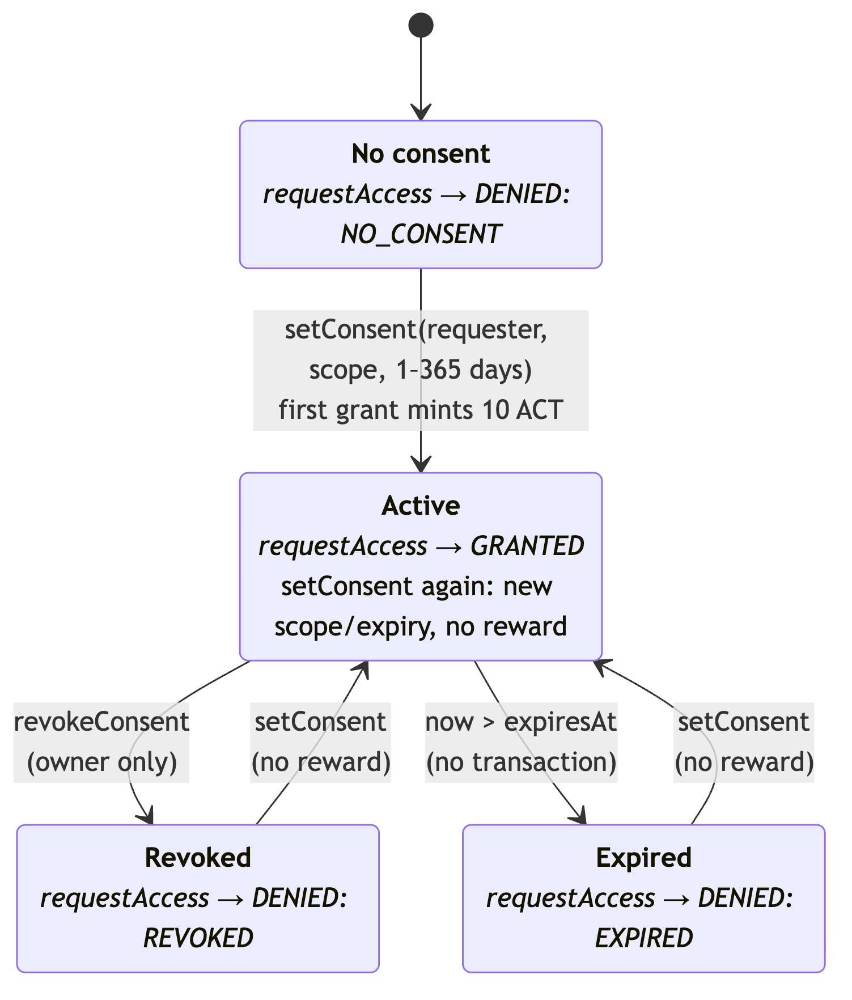
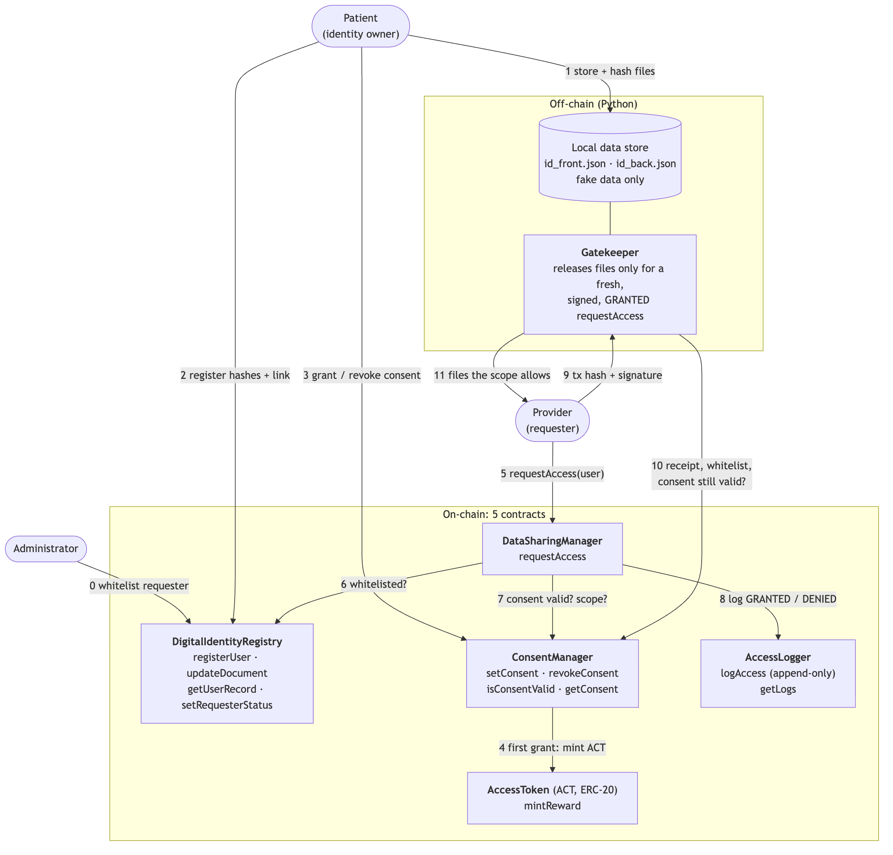
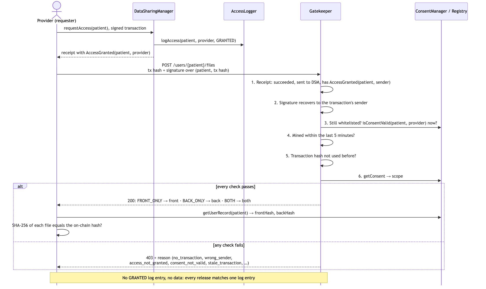

```{=latex}
\begin{titlepage}
\thispagestyle{empty}
\centering
\vspace*{3cm}
{\LARGE\bfseries Decentralized Digital Identity and\\ Government-ID Sharing for Healthcare\par}
\vspace{1.5cm}
{\large Project report, Introduction to Blockchains\par}
{\large Department of Advanced Computing Sciences, Maastricht University\par}
\vspace{1.5cm}
{\large Group [number]\par}
\vspace{1cm}
\begin{tabular}{ll}
{[Name 1]} & {[Student ID]} \\
{[Name 2]} & {[Student ID]} \\
{[Name 3]} & {[Student ID]} \\
{[Name 4]} & {[Student ID]} \\
\end{tabular}
\vfill
{\large [Submission date] October 2026\par}
\end{titlepage}
\setcounter{page}{1}
```

<!--
HOW THIS FILE WORKS (delete this comment before submitting)
- This is the assembled report: headers, figures, tables and references are in
  place. Each "WRITER" box marks text the named workstream writes IN THEIR OWN
  WORDS, using the prompts in ../report-draft.md (same section numbers).
- Build the PDF with ./build.sh (needs pandoc + xelatex). It applies the
  coursebook format: 10pt Times New Roman, double spaced, A4, 1" margins, page
  numbers. Check the page count after every merge (max 10 pages, references and
  code not counted).
-->

# 1. Introduction

::: writer
**WRITER D**, in your own words (prompts: `report-draft.md` §1, about 1 page): the
problem in our domain, how existing systems handle it (cite [1]–[10]), our angle, aims
and objectives, scope and assumptions. Don't give the solution away here.
:::

# 2. Architecture

## 2.1 Actors and permissions

::: writer
**WRITER D + A** (prompts: `report-draft.md` §2.1).
:::

: Roles and permissions

| Role | Initiates | Allowed | Not allowed |
|-----------|---------------------|------------------------------------------|----------------------------------|
| Identity owner (patient) | Registration, document updates, consent grants and revocations | Register hashes + gatekeeper link; grant scoped consent (1–365 days) to whitelisted requesters; revoke at any time; read the access log; earn 10 ACT on the first grant to each requester | Change anyone else's record or consent |
| Requester (provider) | Access requests | Once whitelisted: call `requestAccess`; with its own fresh GRANTED transaction, fetch the files the scope allows from the gatekeeper | Give itself consent; get files without valid consent; alter or suppress log entries; gain access through ACT |
| Administrator | Deployment, whitelist, reward rate | Deploy and wire the contracts once; whitelist or remove requesters; set the reward amount | Get files without consent; grant or revoke consent; write or delete log entries; mint ACT; re-wire minter or logger |

{width=88%}

## 2.2 Functional requirements

::: writer
**WRITER D** (prompts: `report-draft.md` §2.2; source: Step 1 §1.4, 12 requirements).
:::

## 2.3 Data model

::: writer
**WRITER D** (prompts: `report-draft.md` §2.3).
:::

: Data model: what is stored where

| Attribute | On-chain? | Off-chain? | Hashed? |
|------------------------------|-----------|------------------------------|------------------------------|
| Wallet address | Yes | — | No (already a pseudonymous identifier) |
| Full name, date of birth, ID number | No | Yes (inside the ID files) | No |
| Email | No | Yes (local profile) | SHA-256 on-chain, for the uniqueness check |
| Document link (gatekeeper URL) | Yes | — | No |
| Front / back of the ID | No | Yes (local data store, released only by the gatekeeper) | SHA-256 of each file on-chain |
| Consent record (requester, scope, grant/expiry time, revoked) | Yes | — | No (contracts must read it) |
| Access log entry (requester, time, outcome, reason) | Yes | — | No |
| ACT balances | Yes | — | No |

## 2.4 Consent model

::: writer
**WRITER D** (prompts: `report-draft.md` §2.4).
:::

{width=55%}

## 2.5 Audit log

::: writer
**WRITER D** (prompts: `report-draft.md` §2.5).
:::

## 2.6 System architecture

::: writer
**WRITER A + C** (prompts: `report-draft.md` §2.6).
:::

{width=78%}

{width=95%}

# 3. Implementation

## 3.1 Tooling

::: writer
**WRITER A** (prompts: `report-draft.md` §3.1).
:::

## 3.2 Smart contracts

::: writer
**WRITER A** (prompts: `report-draft.md` §3.2: the design decisions and their reasons).
:::

## 3.3 Off-chain components (Python)

::: writer
**WRITER C** (prompts: `report-draft.md` §3.3).
:::

## 3.4 Deployment

::: writer
**WRITER A** (prompts: `report-draft.md` §3.4). Point to the README for the steps.
:::

# 4. Experimental Results

## 4.1 Testing approach

::: writer
**WRITER B** (prompts: `report-draft.md` §4.1).
:::

## 4.2 Test results

::: writer
**WRITER B**: interpret the table (80/80 Solidity and 15/15 gatekeeper tests pass;
100 % line coverage of the five contracts). The full per-test tables are in the
appendix.
:::

: Tested functionality and why it is critical. Test numbers as in Appendix A; R Registry, C ConsentManager, T AccessToken, L AccessLogger, D DataSharingManager, I integration, G gatekeeper

| Functionality | Tests | Why it is critical |
|----------------------------------|-------------|------------------------------------------------|
| Registration stores only hashes + link; empty values rejected | R2–4, R7–9 | The chain is public: registration must never store personal data, and an empty hash couldn't be checked later |
| One identity per address and per email hash | R5, R6 | Prevents duplicate or impersonating identities |
| Document updates by the owner only | R10–13, I76 | A renewed ID replaces the old hashes; only the owner may change it |
| Admin-only requester whitelist | R1, R14, R15 | Only vetted providers may receive consent or request access |
| Consent is scoped, 1–365 days, per requester | C16–19, C23, C24 | Users decide who sees what and for how long |
| Consent only for registered users and whitelisted requesters | C20–22 | No consent to typo'd, malicious or removed addresses |
| Expiry happens by itself at `expiresAt` | C25–27, I75 | Access stops on time without a cleanup transaction |
| Only the owner revokes, once, immediately | C28–33 | Revocation is the user's main control |
| ACT reward once per (user, requester) | C34–39 | Incentive without token farming |
| Only ConsentManager mints; one-time wiring | T40–48, I79 | The admin can't mint ACT |
| Only DataSharingManager logs; one-time wiring | L49–53, I79 | Nobody can forge log entries |
| Log is append-only, ordered, per user, public | L54–59 | An audit trail is only trustworthy if entries can't change |
| Granted access returns exactly the scope, and is logged | D60–64 | Scope is enforced; every access leaves a trace |
| Each denial is logged without reverting | D65–69, I74, I75 | A revert would erase the DENIED entry |
| Tokens never grant access | D70 | Access comes from consent only |
| Non-whitelisted callers revert; removed requesters lose access | D72, D73, I78 | No log spam; untrusted providers are cut off |
| Full workflows across all contracts | I74–80 | The contracts work together as designed, users stay isolated |
| Gatekeeper releases files only for a fresh, signed GRANTED transaction | G1–G15 | The public link alone protects nothing; the gatekeeper does |

## 4.3 Gas costs and optimisation

: Deployment cost per contract (gasUsed of the deployment transaction)

| Contract | Gas before | Gas after | Change | Bytecode (bytes) |
|-----------------------|-----------:|-----------:|-------:|------------:|
| AccessToken | 696,804 | 696,804 | 0.0 % | 2,615 |
| DigitalIdentityRegistry | 772,744 | 759,768 | −1.7 % | 3,148 |
| ConsentManager | 702,661 | 729,611 | +3.8 % | 2,897 |
| AccessLogger | 634,505 | 514,920 | −18.8 % | 2,016 |
| DataSharingManager | 613,162 | 507,916 | −17.2 % | 2,093 |
| **Total** | **3,419,876** | **3,209,019** | **−6.2 %** | |

: Average gas per function before and after optimisation (gasUsed of real transactions, 5 users)

| Function | Before | After | Change | What changed |
|-------------------------|--------:|--------:|--------:|----------------------------------------|
| `registerUser` | 228,236 | 205,958 | −9.8 % | `registered` derived from the email hash: one slot fewer |
| `setConsent` (first grant) | 162,670 | 96,681 | −40.6 % | Consent record packed into 1 slot instead of 4 |
| `setConsent` (re-grant) | 48,354 | 39,265 | −18.8 % | 1 slot rewritten instead of 3 |
| `revokeConsent` | 28,811 | 28,825 | 0.0 % | Not targeted |
| `requestAccess` (granted) | 145,912 | 89,230 | −38.8 % | Enum reason, one consent read, packed log entry and consent |
| `requestAccess` (denied) | 127,968 | 72,302 | −43.5 % | Same |
| `setRequesterStatus` | 47,779 | 47,779 | 0.0 % | Not targeted |

::: writer
**WRITER B** (prompts: `report-draft.md` §4.3): which operations are expensive and why,
which optimisation helped most (packing), and the events-only trade-off (61k / 44k gas
per access, but no on-chain reads; see `step4-deliverable.md` §2.5).
:::

## 4.4 Simulation and scalability

: Scaling in cost and time on the local Hardhat node (M = 3 requesters)

| Users (N) | Total txs | Avg gas / tx | Total gas | Avg confirmation, instant mining | Total time, instant mining | Avg confirmation, 12 s blocks | Total time, 12 s blocks |
|----:|----:|-------:|-----------:|------:|------:|------:|------:|
| 5 | 28 | 96,206 | 2,693,763 | 2.9 ms | 0.63 s | 11.94 s | 72.3 s |
| 10 | 53 | 98,300 | 5,209,898 | 3.4 ms | 1.19 s | 11.89 s | 72.5 s |
| 25 | 128 | 100,076 | 12,809,771 | 2.6 ms | 2.78 s | 11.65 s | 73.2 s |
| 50 | 253 | 100,696 | 25,476,186 | 2.7 ms | 5.65 s | 11.48 s | 74.3 s |

{width=90%}

::: writer
**WRITER C** (prompts: `report-draft.md` §4.4): the setup, whether cost per operation
stays flat (it does), what grows (total gas and time linearly in N; `getLogs` read cost
with the length of one user's log), and what local timing does and doesn't say about a
real network (Lecture 6).
:::

# 5. Discussion and Conclusion

## 5.1 What works

::: writer
**WRITER D**, with input from everyone (prompts: `report-draft.md` §5.1).
:::

## 5.2 Limitations

::: writer
**WRITER D**, with input from everyone (prompts: `report-draft.md` §5.2, including the
A3 decision about the public log).
:::

## 5.3 Next steps

::: writer
**WRITER D** (prompts: `report-draft.md` §5.3).
:::

## 5.4 Conclusion

::: writer
**WRITER D** (prompts: `report-draft.md` §5.4): 4–6 sentences, nothing new.
:::

# 6. Contributions and AI use

::: writer
**EVERYONE** writes their own line: name, workstream, what they built or wrote. Then
the AI transparency statement in the coursebook template (prompts and the list of
AI-assisted parts: `report-draft.md` §6).
:::

# References

```{=latex}
\begin{singlespace}\small
```

[1] Epic Systems Corporation, "MyChart." [Online]. Available: https://www.mychart.org/

[2] U.S. Department of Health and Human Services, Office for Civil Rights, "Change Healthcare Cybersecurity Incident: Frequently Asked Questions." [Online]. Available: https://www.hhs.gov/hipaa/for-professionals/special-topics/change-healthcare-cybersecurity-incident-frequently-asked-questions/index.html

[3] European Parliament and Council, "Regulation (EU) No 910/2014 (eIDAS)," *Official Journal of the EU*, L 257, 2014. [Online]. Available: https://eur-lex.europa.eu/eli/reg/2014/910/oj

[4] European Parliament and Council, "Regulation (EU) 2024/1183 establishing the European Digital Identity Framework," *Official Journal of the EU*, 30 Apr. 2024. [Online]. Available: https://eur-lex.europa.eu/eli/reg/2024/1183/oj/eng

[5] M. Nemec, M. Sys, P. Svenda, D. Klinec and V. Matyas, "The Return of Coppersmith's Attack: Practical Factorization of Widely Used RSA Moduli," in *Proc. ACM CCS*, 2017.

[6] Privacy International, "Access to the details of 1 billion entries of the Aadhaar database available for only 500 rupees," 2018. [Online]. Available: https://privacyinternational.org/examples-abuse/2288/access-deatils-1-billion-entries-aadhaar-database-available-only-500-rupees

[7] J. Cox, "ID Verification Service for TikTok, Uber, X Exposed Driver Licenses," *404 Media*, 26 Jun. 2024. [Online]. Available: https://www.404media.co/id-verification-service-for-tiktok-uber-x-exposed-driver-licenses-au10tix/

[8] "Discord says third-party customer service system breached, 70K users' government IDs exposed," Oct. 2025. [Online]. Available: https://www.kiro7.com/news/trending/discord-says-third-party-customer-service-system-breached-70k-users-government-ids-exposed/I45TDHUZWBFUJLVKCEJU2YUT5E/

[9] W3C, "Decentralized Identifiers (DIDs) v1.0," W3C Recommendation, 19 Jul. 2022. [Online]. Available: https://www.w3.org/TR/did-core/

[10] W3C, "Verifiable Credentials Data Model v2.0," W3C Recommendation, 15 May 2025. [Online]. Available: https://www.w3.org/TR/vc-data-model-2.0/

[11] European Parliament and Council, "Regulation (EU) 2016/679 (GDPR)," Art. 17. [Online]. Available: https://eur-lex.europa.eu/eli/reg/2016/679/oj

[12] G. Kadianakis, lightclient and A. Stokes, "EIP-4444: Bound Historical Data in Execution Clients." [Online]. Available: https://eips.ethereum.org/EIPS/eip-4444

[13] V. Buterin and M. Swende, "EIP-2929: Gas cost increases for state access opcodes." [Online]. Available: https://eips.ethereum.org/EIPS/eip-2929

[14] F. Vogelsteller and V. Buterin, "EIP-20: Token Standard." [Online]. Available: https://eips.ethereum.org/EIPS/eip-20

[15] M. Swende and N. Johnson, "EIP-191: Signed Data Standard." [Online]. Available: https://eips.ethereum.org/EIPS/eip-191

[16] S. Nakamoto, "Bitcoin: A Peer-to-Peer Electronic Cash System," 2008. [Online]. Available: https://bitcoin.org/bitcoin.pdf

[17] Solidity Team, "Solidity v0.8.28 documentation." [Online]. Available: https://docs.soliditylang.org/en/v0.8.28/

[18] OpenZeppelin, "OpenZeppelin Contracts 5.x." [Online]. Available: https://docs.openzeppelin.com/contracts/5.x/

[19] Nomic Foundation, "Hardhat 3 documentation." [Online]. Available: https://hardhat.org/docs

[20] Foundry contributors, "forge-std." [Online]. Available: https://github.com/foundry-rs/forge-std

[21] Ethereum Foundation, "web3.py documentation." [Online]. Available: https://web3py.readthedocs.io/

[22] wevm, "viem documentation." [Online]. Available: https://viem.sh/

[L1]–[L7] C. Jin, *Introduction to Blockchains*, Lectures 1–7 (Foundations; Bitcoin Mechanics; Consensus Protocols; Ethereum & Smart Contracts; DeFi; Scaling the Blockchain; Privacy on the Blockchain), DACS, Maastricht University, 2026.

[T1], [T3] *Introduction to Blockchains*, Tutorial 1 "Ethereum Cryptography" and Tutorial 3 "Understanding Tokenization," DACS, Maastricht University, 2026.

[Lab3]–[Lab5] *Introduction to Blockchains*, Lab 3 "Understanding Smart Contracts," Lab 4 "Inter-Contract Communication," Lab 5 demo DApp, DACS, Maastricht University, 2026.

Web sources accessed on 1 October 2026. Keep only the entries the text cites.

```{=latex}
\end{singlespace}
```

# Appendix A. All tests

The full per-test tables (80 Solidity tests and 15 gatekeeper tests, each with what it
checks and why it is critical) are in `docs/step4-deliverable.md` §1.3–1.4. Paste them
here if the appendix doesn't count towards the page limit (ask a TA), otherwise point
to the code archive.
