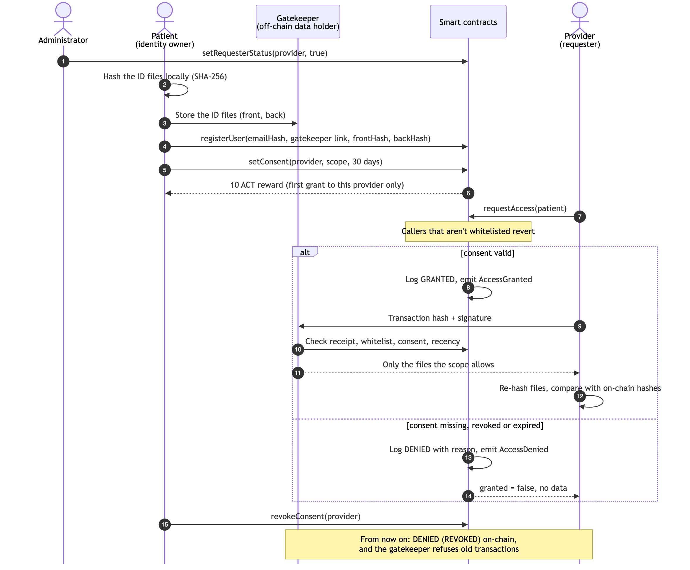

# Step 1 — Research and Planning

## Required Deliverable (as specified in the project brief)

> Problem statement. Defined user roles, the functional requirements and a high level
> overview of how users interact in your systems.

---

## 1.1 Problem Statement

Healthcare providers routinely need to confirm that the person in front of them (or
submitting paperwork remotely) is who they claim to be, by checking a government-issued
ID (national ID card, passport, driver's license). Today this happens through
centralized, ad-hoc mechanisms:

- Front-desk staff photocopy or photograph the ID and store it in the hospital's own
  systems (or a shared drive, or a third-party verification vendor).
- The patient has no visibility into which hospitals, clinics, insurers, or staff
  members retained a copy, for how long, or whether it was ever viewed again.
- A breach at any single hospital, clinic, or vendor exposes the ID images of every
  patient who ever registered there — a "honeypot" of highly sensitive documents.
- Patients cannot revoke access once a copy has been made — the copy already exists
  outside their control.
- There is no tamper-evident, independently verifiable log of who accessed the ID and
  when; audit trails, if they exist, live inside the same system that could be breached
  or altered.
- Patients receive no benefit for repeatedly re-proving their identity across many
  providers, while providers and intermediaries capture all the value.

Our platform addresses this by keeping the actual ID images **off-chain**, under the
patient's control (in a local data store served by a consent-checking *gatekeeper*),
and putting only a **hash-based integrity fingerprint** plus **consent and access
records** on a blockchain. This gives
patients visibility, revocability, and an immutable audit trail, while giving
requesters a way to verify both the *integrity* of the ID (via the hash) and the
*authorization* to view it (via on-chain consent), without any party other than the
patient ever holding a copy of the actual images inside the platform itself.

## 1.2 Research: How Existing Systems Handle This

Sources are numbered as in [`references.md`](references.md).

| System / Approach | What it does | What works | What doesn't work |
|---|---|---|---|
| Hospital-managed patient portals (e.g., MyChart-style systems [1]) | Hospital stores scanned ID/insurance card centrally per patient | Familiar, integrated with existing records | Fully centralized: one breach exposes all patients (the 2024 Change Healthcare attack affected ~190 million people [2]); no cross-provider portability; patient can't see who else viewed the file; no revocation |
| National eID / digital identity schemes (e.g., EU eIDAS [3], [4], Estonia e-ID, India Aadhaar-linked eKYC) | Government-issued digital credential, verified via central or federated authority | Strong identity assurance, broad acceptance | Centralized verification authority is a single point of failure/surveillance (one chip flaw affected every Estonian ID card in 2017 [5]; Aadhaar data was reportedly sold for Rs 500 in 2018 [6]); users have limited control over *which* attributes are disclosed to *which* verifier and for how long (eIDAS 2 now requires selective disclosure in the EU wallet [4]); access logs (if they exist) are not user-auditable |
| Third-party KYC/identity-verification vendors (used by fintechs and some health insurers) | Vendor collects ID photos + selfie, verifies, stores results, resells "verified" status | Convenient one-time verification reused across services | Patient's raw ID images sit in a for-profit vendor's database indefinitely; patient has no say in which future clients the vendor shares "verification" with; ID images held by vendors have leaked (AU10TIX admin credentials exposed for over a year, 2024 [7]; ~70,000 government-ID photos exposed through Discord's support vendor, 2025 [8]) |
| Self-Sovereign Identity / Verifiable Credentials (W3C DID [9] / VC [10] standards) | User holds credentials in a wallet, presents cryptographic proofs instead of raw documents, issuer/verifier model | Strong privacy model, user holds the credential, selective disclosure possible | Standard alone doesn't solve *where the underlying document lives*, *how consent is time-boxed*, or *how access is logged*; adoption/tooling still maturing for raw-document use cases like a photographed government ID |
| Paper/physical ID photocopies at front desks | Manual copy kept in a folder/file cabinet or scanned into local system | Simple, no tech required | No log at all of who later pulled the file; no expiry; no revocation; physical or local-drive breaches are common and undetected for long periods |

**Takeaways we carry into our design:**
1. Keep the actual document off the shared ledger entirely (learn from SSI/DID) — the
   chain should never become a second honeypot.
2. Make consent **explicit, scoped, and time-limited**, not an implicit "I gave it to
   the front desk once, so it's out there forever."
3. Give the **patient**, not the platform operator, the audit trail and the revoke
   button.
4. Reward participation instead of only extracting value from it (existing platforms
   profit from identity data with no benefit passed back to the user).

## 1.3 Users and Roles

| Role | Who (in our domain) | Initiates | Can do |
|---|---|---|---|
| **Identity Owner ("User")** | The patient (e.g., George) | Registration, consent grants, consent revocations, document link updates | Register their identity; upload ID front/back off-chain and register the link + hashes on-chain; grant consent to specific requesters for a specific duration; revoke consent at any time; view their own full access log; earn ACT tokens when granting consent |
| **Requester** | Healthcare providers needing identity verification: doctors, hospital admissions staff, clinics, labs, health insurers | Access requests | Once whitelisted by the admin, request access to a user's ID: the smart contract checks for valid, non-expired, non-revoked consent, and every attempt (granted or denied) is logged automatically, with no ability for the requester to alter or suppress the log entry. A GRANTED transaction is then shown to the gatekeeper, which releases only the files the consent scope allows. Addresses that aren't whitelisted can't call `requestAccess` at all (it reverts) |
| **Administrator** | Platform operator / contract owner (e.g., a healthcare-network consortium multisig) | Deployment, parameter configuration | Deploys the contracts; configures the ACT token reward amount; can register/whitelist requester addresses as legitimate healthcare entities (so random addresses can't spam access requests); **cannot** read user documents, **cannot** grant or revoke consent on a user's behalf, **cannot** delete audit log entries |

Permission summary:

- Only the **Identity Owner** can grant/revoke their own consent (`msg.sender ==
  owner` enforced in the contract).
- Only a whitelisted requester holding **valid consent** gets the user's files
  (through the gatekeeper); any other whitelisted requester's attempt is logged as
  denied and gets no data, and non-whitelisted addresses are rejected outright.
- Only the **Administrator** may register new requester entities and adjust system
  parameters (e.g., token reward rate) — the admin role is intentionally kept out of
  the data path entirely.

## 1.4 Functional Requirements

1. **User registration** — a user registers with a wallet address plus minimal hashed
   identity attributes (hash of email, reference/link to their off-chain document
   store, and hashes of the front/back ID images). No plaintext PII is ever written
   on-chain.
2. **Document reference registration/update** — a user can (re)register the off-chain
   link and hashes if they re-upload or renew their ID (e.g., ID expired, new
   passport).
3. **Consent grant** — a user creates a consent record specifying: the requester's
   address, the data scope (front only / back only / both), and a duration between 1
   and 365 days. A user's first consent grant to each requester mints ACT tokens to
   the user (re-granting to the same requester does not mint again).
4. **Consent revocation** — a user can revoke an active consent at any time before its
   natural expiry; revocation takes effect immediately.
5. **Consent expiry handling** — once `block.timestamp` passes the recorded expiry, the
   consent is automatically treated as invalid by the access-check logic (no separate
   "expire" transaction is required, avoiding needless gas costs).
6. **Data access with consent check** — when a requester calls for access, the contract
   verifies an existing, non-revoked, non-expired consent record exists for that
   (user, requester) pair before releasing the document link/hashes.
7. **Access logging (granted and denied)** — every access attempt, whether it succeeds
   or fails (no consent, expired consent, revoked consent), is appended to an
   immutable on-chain log with requester address, timestamp, and outcome. No function
   exists to delete or edit a log entry.
8. **Token incentive** — users receive ACT (Access Token) rewards when they grant
   consent, as compensation for participating; token possession never grants data
   access by itself — access is governed solely by the consent record.
9. **Data ownership integrity** — at no point does any transaction transfer ownership
   of the underlying ID images; contracts only ever transfer/record *permission to
   view a reference to them*.
10. **Requester registration/whitelisting (domain-specific addition)** — the
    administrator maintains a registry of verified healthcare-provider addresses, so
    that consent can only be granted to entities recognized as legitimate providers
    (reduces risk of granting consent to a typo'd or malicious address).
11. **Hash-based integrity verification (domain-specific addition)** — once a
    requester receives the files from the gatekeeper, they re-hash them and compare
    against the on-chain hashes to detect tampering or a stale/substituted file.
12. **Consent-enforcing gatekeeper (domain-specific addition)** — everything on-chain
    is public, so the off-chain data holder releases a user's files only to a
    requester that presents its own recent, successful `requestAccess` transaction
    containing an `AccessGranted` event, signed with the same key, while consent is
    still valid; it returns only the files the consent scope allows. No GRANTED log
    entry, no data.

## 1.5 High-Level Overview of System Interaction

Source: [`diagrams/1-interaction-sequence.mmd`](diagrams/1-interaction-sequence.mmd)
(re-render with `docs/diagrams/render.sh`).

This overview is expanded into concrete data structures, consent-lifecycle diagrams,
and smart-contract function signatures in
[`step2-deliverable.md`](step2-deliverable.md).

---

## Our Actual Deliverable for Step 1

- **Problem statement** — Section 1.1 above: centralized storage of patients'
  government IDs gives providers no accountability, patients no visibility or
  revocation, and turns every provider into a breach honeypot.
- **Research** — Section 1.2: a 5-system comparison table (hospital portals, national
  eID schemes, KYC vendors, W3C DID/Verifiable Credentials, paper photocopies) with
  what works/doesn't, and the design takeaways carried forward.
- **Defined user roles** — Section 1.3: **User/Identity Owner** (patient), **Requester**
  (doctor/hospital/insurer), **Administrator** (deployment + requester whitelisting
  only, no access to consent or data), with a permissions summary for each.
- **Functional requirements** — Section 1.4: 12 numbered requirements covering
  registration, document-reference updates, scoped time-limited consent (1–365 days),
  revocation, auto-expiry, gated access checks, full granted/denied access logging,
  token incentives, non-transfer of data ownership, requester whitelisting,
  hash-based tamper verification, and the consent-enforcing gatekeeper.
- **High-level interaction overview** — Section 1.5: a sequence diagram tracing the
  full lifecycle (whitelist → store + hash → register → grant consent → access
  request → grant/deny + log → gatekeeper release → revoke) end to end.
