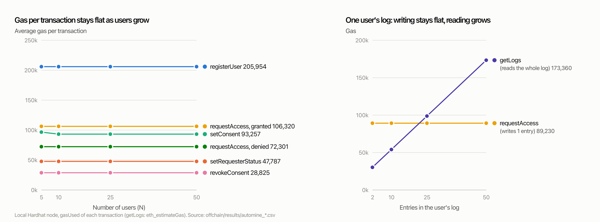

# Step 5 — Deployment and Simulation

## Required Deliverable (as specified in the project brief)

> Tables reporting how well your solution scales in time and cost (for the amount of
> users that you created).

The brief asks to deploy locally, simulate users, requesters and an administrator
interacting, and record the average gas of core operations and the time for
transaction confirmation and event logging.

> AI-assisted: `offchain/simulate.py`, these runs and this write-up were produced with
> Claude Code (Claude Opus 5.5) on 2026-10-01. The team must review them and declare
> this in the report's AI statement.

## Setup

- **Chain:** `npx hardhat node` (Hardhat 3.18, chain id 31337, block gas limit 60M),
  contracts deployed with `npm run deploy:local`, the final (optimised) contracts.
- **Roles:** 1 administrator (Hardhat account #0, the deployer), N users and M = 3
  requesters. Users and requesters are fresh accounts generated with `eth_account`
  and funded with 1 ETH each from account #0, so N isn't limited to the node's 20
  accounts. Each user gets fake ID files (`fake_data.py`), hashes them and registers.
- **Scenario per N**, phase by phase: register (N txs) → admin whitelists the
  requesters (M) → each user grants consent to one requester, round-robin, scopes
  rotating FRONT_ONLY / BACK_ONLY / BOTH, 30 days (N) → each requester requests access
  (N, all GRANTED) → **gatekeeper fetch** with the GRANTED tx, files re-hashed against
  the on-chain hashes (N) → users revoke (N) → requests again (N, all DENIED: REVOKED)
  → **gatekeeper refusal** of both the old GRANTED tx and the new DENIED tx (2N).
  Each user's log is then checked to hold exactly GRANTED, DENIED(REVOKED).
- **Measured:** `gasUsed` from every receipt; send-to-receipt time per transaction;
  round-trip time of every gatekeeper call; total time of the scenario (account
  funding and data generation excluded, since real users would already have ETH and
  their files). Total transactions per run = 5N + M.
- **Two mining modes:** *instant* (Hardhat's default automine: every transaction is
  mined as soon as it arrives), and *12-second blocks* (`--block-time 12`, interval
  mining, roughly Ethereum's slot time). In the second mode each phase is sent at once
  and waits for the next block, like a busy public chain.
- Reproduce: `python offchain/simulate.py --seed step5-automine` and
  `python offchain/simulate.py --seed step5-blocktime12 --block-time 12 --skip-log-growth`
  on a freshly started node. Raw data: `offchain/results/` (per-transaction and
  per-gatekeeper-call CSVs for every N).

## Table 1: scaling in cost and time

| Users (N) | Requesters (M) | Total txs | Avg gas / tx | Total gas | Avg confirmation, instant | Total time, instant | Avg confirmation, 12 s blocks | Total time, 12 s blocks | Gatekeeper calls | Avg gatekeeper round trip |
|---:|---:|---:|---:|---:|---:|---:|---:|---:|---:|---:|
| 5 | 3 | 28 | 96,206 | 2,693,763 | 2.9 ms | 0.63 s | 11.94 s | 72.3 s | 15 | 21.8 ms |
| 10 | 3 | 53 | 98,300 | 5,209,898 | 3.4 ms | 1.19 s | 11.89 s | 72.5 s | 30 | 18.8 ms |
| 25 | 3 | 128 | 100,076 | 12,809,771 | 2.6 ms | 2.78 s | 11.65 s | 73.2 s | 75 | 18.9 ms |
| 50 | 3 | 253 | 100,696 | 25,476,186 | 2.7 ms | 5.65 s | 11.48 s | 74.3 s | 150 | 19.5 ms |

Gas and the gatekeeper times are from the instant-mining run; the 12-second run gave
the same gas to within 0.01 % (`blocktime12s_summary.md`).

## Table 2: average gas per operation as N grows

| Operation | N = 5 | N = 10 | N = 25 | N = 50 | Spread |
|---|---:|---:|---:|---:|---:|
| `registerUser` | 205,958 | 205,952 | 205,954 | 205,954 | 0.0 % |
| `setRequesterStatus` | 47,787 | 47,787 | 47,787 | 47,787 | 0.0 % |
| `setConsent` | 96,676 | 93,256 | 93,257 | 93,257 | 3.7 % * |
| `requestAccess` (granted) | 106,319 | 106,318 | 106,320 | 106,320 | 0.0 % |
| `revokeConsent` | 28,825 | 28,825 | 28,825 | 28,825 | 0.0 % |
| `requestAccess` (denied) | 72,302 | 72,302 | 72,302 | 72,301 | 0.0 % |

\* Not growth: the N = 5 run contains the platform's very first grant, which also
turns ACT's `totalSupply` from zero to non-zero (one extra ~17k-gas SSTORE). In the
12-second run, which started on the same chain, N = 5 averaged 93,256.

## Table 3: one user's log growing (separate experiment)

| Entries in the user's log | `requestAccess` gas (writing the newest entry) | `getLogs` gas (estimate for reading the whole log) |
|---:|---:|---:|
| 2 | 89,230 | 30,250 |
| 10 | 89,230 | 54,051 |
| 25 | 89,230 | 98,733 |
| 50 | 89,230 | 173,360 |

Figure: `python offchain/plot_results.py` (from the CSVs above).

## What the numbers show

- **Cost per operation is flat in N.** Every mapping is keyed by address
  (`identities[user]`, `consents[user][requester]`, `logs[user]`), so a transaction
  touches the same number of storage slots whether there are 5 users or 50. Average
  gas per transaction rises slightly from 96k to 101k only because the mix changes
  (M = 3 whitelist transactions are a smaller share at higher N).
- **Total gas and total time grow linearly with N** (5N + M transactions). With
  instant mining the platform sustained about 45 transactions per second from one
  Python client, i.e. the client and RPC round trip, not the chain, set the pace.
- **Writing to a log is O(1); reading a whole log is O(entries).** Appending costs
  89,230 gas at 2 or 50 entries (one new slot plus the array length), while
  `getLogs` grows by about 3,000 gas per entry. `getLogs` is a free `eth_call` for
  off-chain readers, but a contract that read it would pay that, and RPC providers cap
  `eth_call` gas, so a very long log would need paging (`getLogCount` + ranges).
- **Confirmation time is set by the block interval, not by our contracts.** Locally,
  a transaction is confirmed in about 3 ms; with 12-second blocks it waits about 12 s
  (11.5–11.9 s on average, depending on when in the slot it arrives). Total time with
  12-second blocks stays around 72–74 s for every N, because each of the six phases
  fits in a single block: the largest, 50 registrations, used 10.3M of the 60M gas
  limit. The block gas limit becomes the bottleneck at about 60M / 205,954 ≈ 291
  registrations or 60M / 72,302 ≈ 830 denied accesses per block, i.e. roughly 24
  registrations or 69 access checks per second at 12-second blocks, shared with every
  other user of the chain (Lecture 6 §1.2).
- **Gatekeeper round trip** (HTTP + 7 RPC reads + signature check + reading the files)
  is about 20 ms and doesn't depend on N.

## What local results don't show

- Real fees: on a public chain each operation costs gas × gas price, and the price
  varies with demand. Our gas numbers give the cost in gas, the part we control.
- Real network latency, mempool competition and confirmation depth (waiting for
  several blocks, or finality, before trusting an access log entry).
- Many concurrent clients: the simulation is one Python process sending in phases.

A public testnet run was optional in the brief and wasn't done.
