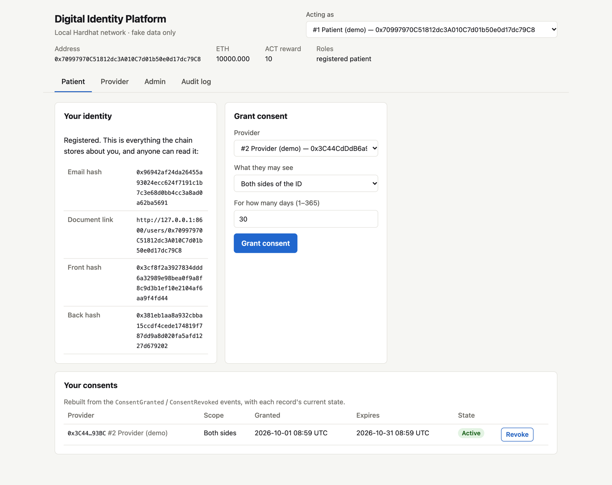
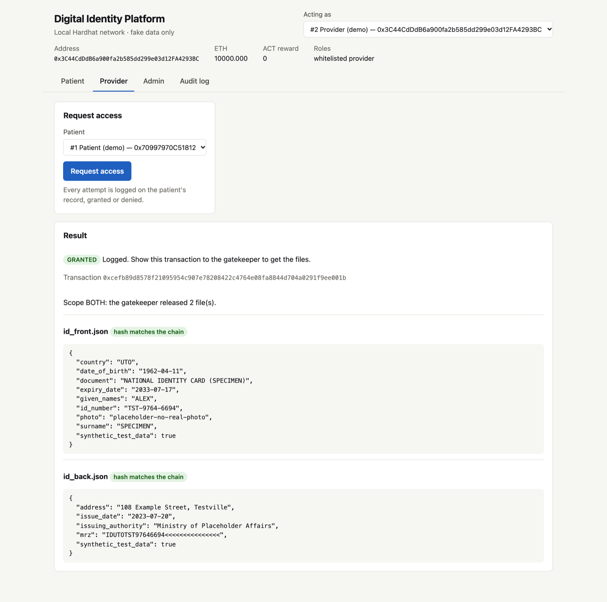
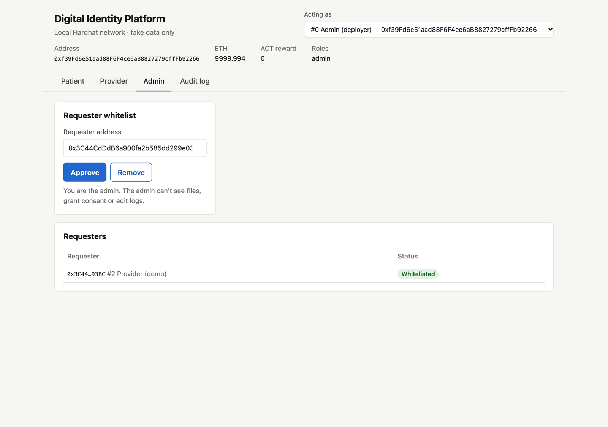
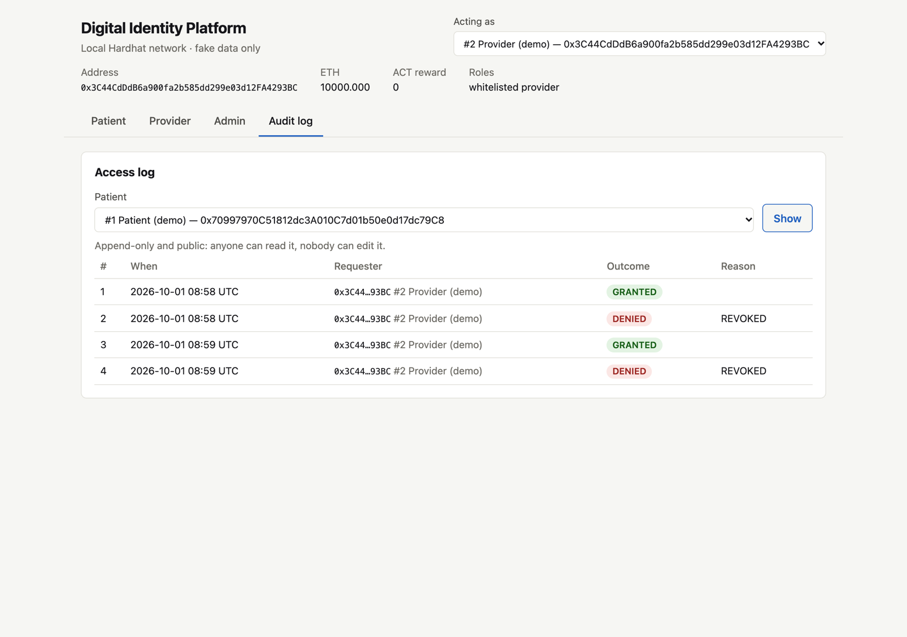
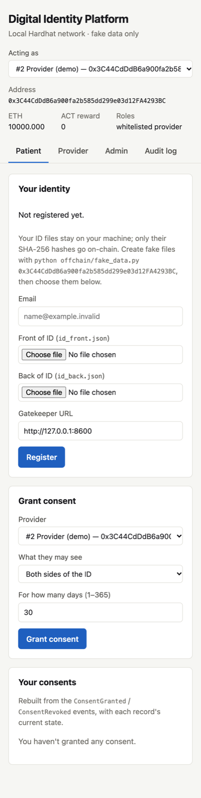

# Wireframes (Step 6)

Basic wireframes for the four screens, drawn before building the page, followed by
screenshots of the implemented UI. One page, one tab per role; a shared header shows
who you're acting as.

> AI-assisted: drafted with Claude Code (Claude Opus 5.5) on 2026-10-01; must be
> reviewed by the team and declared in the report's AI statement.

## Shared header

```
┌──────────────────────────────────────────────────────────────────────────┐
│ Digital Identity Platform                    Acting as [#1 Patient ▾]    │
│ Local Hardhat network · fake data only                                   │
│                                                                          │
│ Address 0x7099…79C8   ETH 9999.99   ACT reward 10   Roles: patient       │
├──────────────────────────────────────────────────────────────────────────┤
│  Patient │ Provider │ Admin │ Audit log                                  │
└──────────────────────────────────────────────────────────────────────────┘
```

## Patient: identity and consent

```
┌─ Your identity ───────────────────┐  ┌─ Grant consent ───────────────────┐
│ Not registered yet.               │  │ Provider      [#2 Provider     ▾] │
│ (hint: python offchain/fake_data… │  │ What they see [Both sides      ▾] │
│ Email          [_______________]  │  │ Days (1–365)  [30]                │
│ Front of ID    [Choose file]      │  │ [Grant consent]                   │
│ Back of ID     [Choose file]      │  └───────────────────────────────────┘
│ Gatekeeper URL [http://…:8600]    │
│ [Register]                        │   after registering, the left card
└───────────────────────────────────┘   shows the on-chain record instead
┌─ Your consents ──────────────────────────────────────────────────────────┐
│ Provider        Scope        Granted     Expires     State     │         │
│ #2 Provider     Both sides   01 Oct      31 Oct      ● Active  │[Revoke] │
│ #4 Test acct    Front only   01 Oct      02 Oct      ● Expired │         │
└──────────────────────────────────────────────────────────────────────────┘
```

## Provider: request access, then fetch from the gatekeeper

```
┌─ Request access ──────────────────┐
│ Patient  [#1 Patient (demo)    ▾] │
│ [Request access]                  │
│ Every attempt is logged.          │
└───────────────────────────────────┘
┌─ Result ─────────────────────────────────────────────────────────────────┐
│ ● GRANTED  Logged. Show this transaction to the gatekeeper.              │
│ Transaction 0x2e92…                                                      │
│ [Fetch the files from the gatekeeper]                                    │
│                                                                          │
│ id_front.json  ● hash matches the chain    { …fake ID fields… }          │
│ id_back.json   ● hash matches the chain    { …fake ID fields… }          │
│                                                                          │
│ (denied instead:  ● DENIED: REVOKED  Logged. No data released.)          │
└──────────────────────────────────────────────────────────────────────────┘
```

## Admin: whitelist

```
┌─ Requester whitelist ─────────────┐  ┌─ Requesters ──────────────────────┐
│ Requester address [0x…        ]   │  │ #2 Provider (demo)  ● Whitelisted │
│ [Approve]  [Remove]               │  │ #4 Test account     ● Removed     │
│ Only the admin can change this.   │  └───────────────────────────────────┘
└───────────────────────────────────┘
```

## Audit log (anyone)

```
┌─ Access log ─────────────────────────────────────────────────────────────┐
│ Patient [#1 Patient (demo) ▾]  [Show]                                    │
│ Append-only and public: anyone can read it, nobody can edit it.          │
│ #  When              Requester      Outcome    Reason                    │
│ 1  01 Oct 10:00 UTC  #2 Provider    ● GRANTED                            │
│ 2  01 Oct 10:05 UTC  #2 Provider    ● DENIED   REVOKED                   │
└──────────────────────────────────────────────────────────────────────────┘
```

## As built

Taken from a full run on the local network (register → whitelist → grant → GRANTED →
gatekeeper fetch with matching hashes → revoke → DENIED: REVOKED → log).

| Patient | Provider |
|---|---|
|  |  |

| Admin | Audit log | Phone width (390 px) |
|---|---|---|
|  |  |  |
